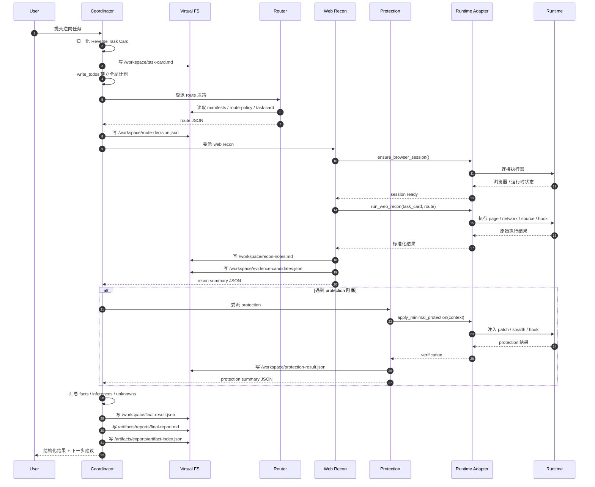

# Reverse DeepAgent 架构设计（Web Reverse Demo v0）

## 1. 文档目标

这份文档回答 5 个问题：

1. 多 Agent 协同怎么拆
2. 输出收口成哪几种形式
3. `deepagents` 的虚拟文件系统、子智能体、任务规划和总结能力怎么用
4. `MCP` 在体系里处于什么位置，未来怎么迁移
5. 当前项目目录应该怎么整理，后续实现才能不乱

当前目标仍然是 **Web / JS 逆向优先的最小 Demo**，但架构上保留 Android / iOS / 小程序等执行器的扩展位。

## 2. 设计原则

- `deepagents` 负责 **编排、规划、上下文管理、子任务隔离**，不负责替代方法论资产
- `js-reverse` 继续作为 **技能与方法资产层**，负责 route、playbook、capability、protection、evidence contract
- 底层执行能力必须通过 **runtime adapter** 抽象，不让上层 Agent 直接绑定具体 `MCP tool name`
- 中间结果优先落虚拟文件系统，主消息流只传 **结构化摘要**
- 首版只做 **少 Agent、强边界、最小闭环**，不追求“大而全逆向平台”

## 3. 分层架构

```text
User Task
  -> Reverse Coordinator (deepagents main agent)
    -> Router Subagent
    -> Web Recon Subagent
    -> Protection Subagent
    -> Runtime Adapter Layer
      -> MCP Runtime / CLI Runtime / CDP Runtime / Future Mobile Runtime
    -> Virtual Filesystem + Artifacts + Memory
```

### 3.1 方法层

方法层不直接执行，而是提供统一知识框架：

- `manifests/*.json`
- `references/playbooks/*.md`
- `references/capabilities/*.md`
- `references/protections/*.md`
- `references/master/*.md`

作用：

- 统一 route 规则
- 统一输出契约
- 统一证据强度判断
- 统一 protection 的启用条件与验证方式

### 3.2 编排层

编排层由 `deepagents` 承担，主要解决：

- 长任务规划：`write_todos`
- 子任务隔离：`subagents`
- 中间结果承载：`backend`
- 长上下文压缩：`summarization`
- 结构化交接：`response_format`

### 3.3 执行层

### 3.3.1 Chrome Debug Session 约束

真实 Web runtime 不允许隐式假设 Chrome debug 端口已存在。

约束如下：

- `mcp` runtime 执行 Web recon 前必须先检查 Chrome DevTools session
- 若端口不可用，必须结构化失败并给出 `next_action=ensure_browser_session`
- 若用户或上层策略显式启用自动准备，可以调用推荐启动脚本启动受管 Chrome
- 推荐脚本必须参数可调，至少支持 Chrome 路径、debug port、debug address、user data dir、start URL、extra args、wait seconds
- 启动脚本只接管自己启动的 Chrome，不盲杀占用端口的非托管进程
- runtime adapter 必须把实际启动的 `browser_url` 传给 MCP 后端，不能一边启动自定义端口、一边让 MCP 继续连默认 `9222`
- `jsreverser-mcp` 的真实返回经常是 Markdown + fenced JSON + traceId 的混合文本，adapter 必须先归一化再进入 schema，不允许把原始文本形态泄露给上层 Agent 做判断

推荐脚本：

- `<repo-root>/scripts/start_chrome_debug.sh`
- `<repo-root>/scripts/stop_chrome_debug.sh`

当前已验证 smoke：

- `src/reverse_deepagent/coordinator.py`
- 包内稳定协调入口已从 CLI 脚本中抽离，后续所有入口都应复用 `run_reverse_pipeline()`
- `pyproject.toml` 现已声明 console script `reverse-agent-demo = reverse_deepagent.cli:main_demo`
- `scripts/run_deepagent_smoke.py`
- `build_reverse_agent()` 已与当前 deepagents 版本对齐，可完成一次真实 `agent.invoke()`，并把 route tool 的结果回流到消息链
- `scripts/run_deepagent_subagent_smoke.py`
- 主 Agent 可通过 `task` 工具委派 general-purpose 子 Agent，并把子 Agent 的结果回收到主线程消息链
- `pyproject.toml` 已补齐，项目可通过 uv editable 安装，不再只依赖手工 `PYTHONPATH`
- 安装后可直接使用 console script：`reverse-agent-demo`
- `reverse-agent-fixture` / `reverse-agent-fixture-smoke`
- 本地 sign fixture 已落地，可提供 `/app.js` 中的 `buildSign` / `x-sign` 入口和 `/api/search` 网络请求样本
- 真实 MCP + 受管 Chrome 对 fixture smoke 已验证 `status=success`、`next_action=move_to_source_analysis`
- Web recon 已支持证据晋升：从 source hit 自动调用 `get_script_source` 拉源码上下文，从 request hit 自动调用 `get_request_initiator` 拉请求发起链路
- Web recon 已支持候选函数卡片：把 source context、source hit、related request、initiator 合并为 `function-candidates.json`
- workspace 虚拟 artifact 已同步落盘，避免只有 `virtual://workspace/...` 引用而没有真实文件
- `scripts/run_demo.py --runtime mcp --ensure-chrome --chrome-debug-port 9445`
- 使用隔离 profile `/tmp/reverse-agent-chrome-9445`
- 能完成受管 Chrome 启动、MCP 接入、Web recon 结构化输出与自动停止
- 未使用 `--keep-chrome` 时，执行结束后不应残留该端口监听

执行层通过 runtime adapter 对外暴露高层语义动作，不直接把原子工具暴露给主 Agent。

首版主要接：

- `jsreverser-mcp`

未来可替换为：

- 本地 CLI
- Playwright + CDP
- Chrome DevTools 协议
- Frida / mitmproxy / ADB / iOS device 工具链

当前执行层里的浏览器会话、Chrome debug port、JSReverser MCP、Web storage 和 replay URL 推导都属于 Web-only 假设，统一记录在 `docs/runtime/web-runtime-assumptions.md`。Android / iOS / 小程序 adapter 应通过各自的 runtime interface 和 capability metadata 接入，不应把 app process、Frida session 或 vendor devtools project 伪装成 browser session。

## 4. 多 Agent 协同设计

首版建议 **1 个主 Agent + 3 个专用子 Agent**。

### 4.1 Reverse Coordinator（主 Agent）

职责：

- 接收用户自然语言任务
- 归一化 `Reverse Task Card`
- 维护全局 `write_todos`
- 根据 route 结果决定当前 `mode / playbook / stage`
- 委派执行型子 Agent
- 归并证据并输出最终结果

输入：

- 用户任务
- 子 Agent 的结构化摘要
- 虚拟文件系统中的候选证据与 artifacts 引用

输出：

- `/workspace/final-result.json`
- `/artifacts/reports/final-report.md`
- `/artifacts/exports/artifact-index.json`

### 4.2 Router Subagent

职责：

- 读取 manifests 与 route-policy
- 判断任务属于哪种 `mode`
- 决定首个 `playbook` 与 `stage`

推荐输出：

```json
{
  "selected_mode": "full-workflow",
  "selected_playbook": "references/playbooks/full-workflow.md",
  "initial_stage": "recon",
  "confidence": "high",
  "next_action": "delegate_to_web_recon"
}
```

### 4.3 Web Recon Subagent

职责：

- 保证浏览器会话可用
- 选择或导航目标页面
- 进行 request / source / initiator / hook 侦察
- 生成候选证据

特点：

- 内部可以调用多次执行能力
- 对主 Agent 只返回“摘要 + 文件路径”
- 大结果不直接回消息

### 4.4 Protection Subagent

职责：

- 识别并处理最常见阻塞：
  - `debugger`
  - `console.clear`
  - `devtools-size`
  - `redirect / location`
- 应用最小 protection
- 验证是否恢复主线

作用边界：

- 只修阻塞，不接管主流程
- 修完就把控制权交还给 Coordinator

## 5. 协同时序图



## 6. 输出形式设计

系统最终输出分 3 层。

### 6.1 Structured JSON

这是主输出，也是后续自动化的基准格式。

```json
{
  "task_card": {},
  "mode": "full-workflow",
  "stage": "recon|source|hook|protection|replay",
  "status": "success|partial|failed",
  "key_findings": {
    "facts": [],
    "inferences": [],
    "unknowns": []
  },
  "evidence": [],
  "artifacts": [],
  "next_action": "...",
  "confidence": "low|medium|high"
}
```

### 6.2 Markdown 报告

路径：`/artifacts/reports/final-report.md`

给人看，适合：

- 审阅
- 留档
- 交接
- 复制给其它 Agent 或工程师

### 6.3 Artifact Index

路径：`/artifacts/exports/artifact-index.json`

记录：

- 截图
- session report
- rebuild bundle
- evidence 文件
- 调试日志

## 7. 虚拟文件系统设计

### 7.1 目录职责

建议以 **语义职责** 划分，而不是按文件类型乱堆：

```text
/workspace/
  task-card.md
  route-decision.json
  todos.md
  recon-notes.md
  evidence-candidates.json
  evidence-validated.json
  protection-result.json
  final-result.json

/artifacts/
  reports/
  exports/
  screenshots/
  session/
  rebuild/

/memories/
  sites/
  protections/
  patterns/
```

### 7.2 Backend 策略

推荐 `CompositeBackend`：

- `/workspace/` -> `StateBackend`
- `/artifacts/` -> `FilesystemBackend`
- `/memories/` -> `StoreBackend`（已启用，默认开发环境使用进程内 `InMemoryStore`，可传入共享 store / namespace）

原因：

- `workspace` 适合当前任务临时状态
- `artifacts` 适合持久化、人工检查
- `memories` 适合长期复用；只沉淀跨任务稳定经验，不保存未验证的一次性证据

### 7.3 证据晋升机制

中间结果不要一上来就算结论。

已实现三段式 artifacts：

1. 候选证据：`/workspace/evidence-candidates.json`
2. 已验证证据：`/workspace/evidence-validated.json`
3. 晋升摘要：`/workspace/evidence-promotion.json`
4. 最终结果：`/workspace/final-result.json`

通用晋升规则由 `reverse_deepagent.evidence.promote_evidence(...)` 负责，保持平台中立：

- 所有 `EvidenceItem` 先进入 candidates。
- 高置信、有 source / details / sample / count / runtime validation 信号的证据进入 validated。
- source context、callstack、runtime context、function candidate / validation、platform probe 等关键证据可进入 promoted。
- 低置信、工具不可用、`available=false`、unsupported 或 failed 信号会进入 rejected 或停留在 candidate。

### 7.4 Review Gate

`review_hints` 自动 gate 已实现为 `reverse_deepagent.review_gate.evaluate_review_gate(...)`。

输入：

- `RebuildResult.rebuild_plan.ready`
- `RebuildResult.rebuild_plan.review_hints`
- `EvidencePromotionResult.summary`

输出：

- `/workspace/review-gate.json`

Gate 规则：

- `risk` hint、`ready=false` 或 validated evidence 缺失会 block。
- `ready=true` 但 promoted evidence 缺失会 block。
- warning hint 会 warn，但不自动 block。
- rejected evidence 存在且无阻断项时会 warn。
- pass 只表示自动交付门禁允许继续，不代表替代人工最终验收。

## 8. 任务规划与总结机制

### 8.1 `write_todos`

全局 todo 只让主 Agent 管，避免多个子 Agent 同时改总计划。

建议全局步骤：

1. 归一化 task card
2. 完成 route 决策
3. 完成 web recon
4. 如有需要，应用 protection
5. 汇总 evidence
6. 输出 final result

### 8.2 子 Agent 的局部计划

子 Agent 可以在自己的上下文里做轻量微计划，但不回写全局 todo，避免噪音。

### 8.3 Summarization

让 `deepagents` 的上下文总结机制负责压缩长过程，但 summary 不能替代文件系统中的中间结果。原则仍然是：

- 大材料写文件
- 摘要留消息

## 9. Runtime Adapter 设计

### 9.1 为什么要 adapter

因为 `MCP` 很重，而且名字、参数、实现方式都不适合作为上层架构的稳定接口。

如果上层 Agent 直接依赖：

- `list_pages`
- `network_request`
- `hook_function`
- `take_screenshot`

后面你换执行器，主架构就得一起重写。

### 9.2 上层应该看到的高层动作

建议只暴露这些语义化接口：

- `ensure_browser_session()`
- `route_reverse_task(task_text | task_card)`
- `run_web_recon(task_card, route_result)`
- `apply_minimal_protection(protection_name, context)`
- `export_reverse_artifacts()`

### 9.3 对 MCP 的态度

不是“废掉 MCP”，而是“把 MCP 降级成一个当前 runtime backend”。

建议演进路线：

```text
当前：
Agent -> Runtime Adapter -> jsreverser-mcp

后续：
Agent -> Runtime Adapter -> CLI / CDP / Playwright / Frida / mitmproxy
```

### 9.4 CLI 和 Skill 的分工建议

#### 保留为 Skill 的内容

- route / playbook / capability / protection 规范
- evidence contract
- 设计规则
- 方法论与案例说明

#### 下沉为 Python / CLI 的内容

- task card 归一化
- manifests 读取
- route 选择实现
- evidence merge / scoring
- artifacts 整理
- 结果导出
- runtime adapter 封装

#### 当前继续留给 MCP runtime 的内容

- 浏览器会话接管
- 页面交互
- network / source / hook / breakpoint
- session 导出与截图
- 原始工具结果采集；但返回形态归一化、错误语义转换和证据结构化必须在 adapter 层完成

## 10. 当前目录整理建议

本项目建议按下面结构维护：

```text
reverse_agent/
├─ .venv/
├─ docs/
│  ├─ design/
│  │  └─ reverse-deepagent-architecture.md
│  ├─ plans/
│  │  └─ 2026-05-26-deepagents-js-reverse-agent-plan.md
│  └─ reference/
│     └─ deepagents/
│        ├─ ch01-agent-harness.md
│        ├─ ch02-quickstart.md
│        ├─ ch03-virtual-filesystem.md
│        ├─ ch04-task-planning.md
│        └─ ch05-subagents.md
├─ src/
│  └─ reverse_deepagent/
│     ├─ adapters/
│     ├─ prompts/
│     ├─ runtime/
│     ├─ schemas/
│     ├─ subagents/
│     └─ tools/
├─ scripts/
├─ artifacts/
│  ├─ exports/
│  ├─ rebuild/
│  ├─ reports/
│  ├─ screenshots/
│  └─ session/
└─ tests/
```

## 11. 下一步最适合落地的实现顺序

1. 定 `schemas`：`TaskCard / RouterResult / ReconResult / ProtectionResult / FinalResult`
2. 定 `runtime adapter` 抽象接口
3. 组装主 Agent 与 3 个子 Agent
4. 接 `jsreverser-mcp` 的首个 runtime 实现
5. 跑通 `web recon` 的最小 Demo
6. 再补 protection 和 artifact 导出

## 12. 一句话收口

首版不要把自己做成一个“工具名驱动的 MCP 大泥球”，而是要做成：

> 以 `deepagents` 为编排核心、以 `js-reverse` 为方法资产层、以 `runtime adapter` 为执行抽象的逆向专用 Agent Demo。
