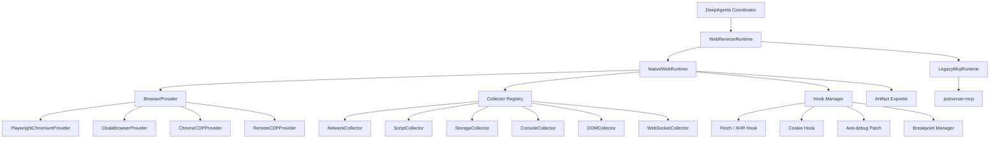

# Browser Provider Architecture and MCP Deprecation Boundary

## 1. Decision

`reverse-deepagent` should not treat MCP as the core Web runtime abstraction.

The long-term Web runtime boundary is:

```text
DeepAgents coordinator
  -> WebReverseRuntime
    -> Native Web Runtime
      -> BrowserProvider
      -> Collectors
      -> Hook / Debug managers
      -> Artifact exporters
```

`jsreverser-mcp` remains useful as a compatibility backend while native browser capabilities are being built, but it is not the architecture center. The replaceable module is the browser provider, not MCP.

## 2. Why MCP must move out of the core path

MCP currently bundles several responsibilities into one external process:

- browser connection and page automation,
- network capture,
- script cache and source search,
- callstack / initiator lookup,
- hooks and breakpoints,
- WebSocket inspection,
- report / export helpers,
- optional AI-enhanced analysis.

That is convenient for a prototype, but it is a migration liability:

| Problem | Impact |
| --- | --- |
| External stdio process | Harder local setup, harder CI, more failure modes. |
| Tool-name coupling | Upper layers start depending on MCP tool names instead of stable project contracts. |
| Browser coupling | Chrome DevTools session assumptions leak into runtime orchestration. |
| Weak portability | A new machine needs `jsreverser-mcp`, Chrome, CDP port, and matching MCP semantics. |
| Feature bundling | It is hard to replace only the browser while keeping collectors stable. |

The project should own its Web evidence model and browser instrumentation. MCP can stay as a legacy backend for comparison and compatibility, but the default direction is native.

## 3. Target layering



The coordinator consumes stable project schemas:

- `TaskCard`
- `RouterResult`
- `ReconResult`
- `FinalResult`
- `RuntimeBackendCapabilities`
- `EvidenceItem`
- `RuntimeArtifactManifest`

The coordinator must not consume:

- raw MCP tool names,
- raw Playwright page objects,
- raw CDP messages,
- browser-specific profile or process details,
- target-specific cookies, tokens, or headers outside normalized evidence.

## 4. BrowserProvider contract

A browser provider owns browser lifecycle and exposes normalized sessions/pages. It does not decide reverse-engineering strategy.

Suggested minimal contract:

```python
class BrowserProvider(Protocol):
    def describe(self) -> BrowserProviderCapabilities: ...
    def start(self) -> BrowserSession: ...
    def connect(self) -> BrowserSession: ...
    def stop(self) -> None: ...
    def is_available(self) -> bool: ...
```

Suggested session/page contract:

```python
class BrowserSession(Protocol):
    provider_id: str
    def list_pages(self) -> list[BrowserPageRef]: ...
    def new_page(self, url: str | None = None) -> BrowserPage: ...
    def get_active_page(self) -> BrowserPage | None: ...
    def close(self) -> None: ...

class BrowserPage(Protocol):
    url: str
    def goto(self, url: str, timeout: float | None = None) -> None: ...
    def title(self) -> str: ...
    def content(self) -> str: ...
    def evaluate(self, expression: str) -> Any: ...
    def screenshot(self, path: str | None = None) -> bytes | None: ...
    def cdp_session(self) -> BrowserCDPSession | None: ...
```

`cdp_session()` is optional. Some providers can support strong Playwright APIs without exposing full CDP control.

## 5. BrowserProvider capability metadata

Every provider should expose non-secret capability metadata. Example fields:

```python
class BrowserProviderCapabilities(SchemaBaseModel):
    provider_id: str
    display_name: str
    engine: str
    transport: str
    supports_launch: bool
    supports_connect: bool
    supports_persistent_context: bool
    supports_cdp: bool
    supports_playwright_api: bool
    supports_proxy: bool
    supports_stealth: bool
    supports_humanize: bool
    supports_extensions: bool
    supports_network_events: bool
    supports_response_body: bool
    supports_request_initiator: bool
    supports_script_source: bool
    supports_websocket_frames: bool
    supports_breakpoints: bool
    supports_runtime_eval: bool
```

This lets routing and doctor commands answer precise questions:

- Can this provider preserve login state?
- Can it collect request initiators?
- Can it expose script source?
- Can it run breakpoints?
- Is it stealth-oriented?

## 5.1 BrowserProvider smoke matrix and lifecycle baseline

`reverse_deepagent.browser.smoke` defines the reusable BrowserProvider smoke matrix contract. The default matrix covers:

- `playwright-chromium`
- `cloakbrowser`
- `remote-cdp`

The matrix records standard capability flags, supported modes, and lifecycle stages:

```text
configured -> capability_described -> availability_checked -> session_start_requested -> session_opened -> page_ready -> session_closed
```

The default matrix path is metadata-only and side-effect free: it instantiates provider objects and reads `describe()` output, but does not import optional browser binaries, probe remote CDP endpoints, launch browsers, or touch MCP. Availability checks and launch smoke are explicit knobs. Doctor exposes this through:

```bash
reverse-agent-doctor --browser-provider-matrix
```

Single-provider doctor checks keep the existing `browser_provider` shape and add `browser_provider.smoke_matrix`; explicit `--launch-browser-smoke` is still the only path that can open a real provider session. Future runtime artifacts can use `workspace/browser-provider-smoke.json`; the workspace contract already indexes that path as `/workspace/browser/browser-provider-smoke.json` without migrating existing outputs.

## 6. Provider candidates

| Provider | Purpose | Notes |
| --- | --- | --- |
| `playwright-chromium` | Stable native default and CI baseline. | Good first native provider; lower stealth. |
| `cloakbrowser` | Stealth-oriented browser provider. | Preferred for fingerprint-sensitive targets; supports launch / persistent context and CDP connect to an existing CloakBrowser or cloakserve endpoint. |
| `chrome-cdp` | Connect to local Chrome DevTools endpoint. | Good for migration and local debugging. |
| `remote-cdp` | Connect to browserless, Docker, remote Chrome, or `cloakserve`. | Good for self-hosted runner isolation. |
| `legacy-mcp` | Existing JSReverser MCP adapter. | Compatibility only; not the default long-term path. |

## 7. CloakBrowser role

CloakBrowser should implement `BrowserProvider`, not replace the whole runtime.

Target shape:

```text
CloakBrowserProvider
  -> Playwright-compatible BrowserSession
    -> shared native collectors
```

That lets `cloakbrowser` and `playwright-chromium` reuse the same collector stack. The browser becomes replaceable without rewriting recon logic.

Important constraints:

- Keep `cloakbrowser` as an optional dependency.
- Do not commit or redistribute CloakBrowser binaries in this repository.
- Prefer persistent profile support for login-state workflows.
- Prefer native CloakBrowser API for humanized behavior; CDP-only connections may not inherit all wrapper-level humanization.
- Treat `cloakserve` / remote CDP as an optional deployment mode: use `--browser cloakbrowser --browser-url ...` when preserving CloakBrowser provider metadata matters, or `remote-cdp` for a generic CDP endpoint.

## 8. Native collectors

Collectors are project-owned modules. They should emit normalized evidence and artifacts independent of browser provider.

Initial collectors:

| Collector | Output |
| --- | --- |
| `DOMCollector` | DOM tree summary, visible text, selector hints. |
| `StorageCollector` | Cookies, localStorage, sessionStorage, selected navigator/runtime context. |
| `ConsoleCollector` | Console logs, warnings, errors. |
| `NetworkCollector` | Request/response samples, headers, status, timings, optional body metadata. |
| `ScriptCollector` | Script URLs, script IDs, source cache, keyword search hits, source snippets. |
| `WebSocketCollector` | WebSocket URLs, frame metadata, payload samples when safe. |
| `ScreenshotCollector` | Page screenshots for visual verification. |

Advanced collectors can use CDP when available and gracefully degrade to Playwright events when not.

## 9. Hook and debug managers

Hooks and debugging should also be project-owned:

| Manager | Purpose |
| --- | --- |
| `FetchXhrHook` | Capture request parameters and response metadata at runtime. |
| `CookieHook` | Observe cookie writes and auth-related mutations. |
| `WebSocketHook` | Capture app-level WebSocket send/receive when CDP frame data is insufficient. |
| `AntiDebugPatch` | Minimal patches for `debugger`, `console.clear`, redirect traps, and DevTools-size checks. |
| `BreakpointManager` | Provider-neutral CDP breakpoint setup behind capability checks, including opt-in paused callframe evaluation. |

Current baseline supports explicit `apply_minimal_protection` breakpoint requests and returns `breakpoints.json`, paused snapshot, callframe, and optional callframe-evaluation artifact refs; default recon must not set breakpoints implicitly.

## 10. NativeWebRuntime target

`NativeWebRuntime` should be the new Web default once it has enough parity.

Suggested construction:

```python
runtime = NativeWebRuntime(
    browser_provider=browser_registry.create("cloakbrowser", config=cloak_config),
    collectors=collector_registry.default_for(provider_capabilities),
    hook_manager=BrowserHookManager(...),
)
```

CLI direction:

```bash
reverse-agent-demo \
  --runtime native-web \
  --browser cloakbrowser \
  --task-text "https://example.com 找 sign 入口"
```

Current compatibility path:

```bash
reverse-agent-demo \
  --runtime legacy-mcp \
  --ensure-chrome
```

`legacy-mcp` is the explicit compatibility backend id; `mcp` and `jsreverser-mcp` remain deprecated runnable aliases during the transition window.

## 11. Artifact compatibility

The native runtime should preserve current artifact semantics:

- `workspace/task-card.json`
- `workspace/route-decision.json`
- `workspace/recon-result.json`
- `workspace/final-result.json`
- `workspace/network-requests.json`
- `workspace/source-hits.json`
- `workspace/request-initiators.json`
- `workspace/response-bodies.json`
- `workspace/source-contexts.json`
- `workspace/websocket-frames.json`
- `workspace/runtime-context.json`
- `workspace/dom-snapshot.json`
- `workspace/script-inventory.json`
- `workspace/console-messages.json`
- `workspace/navigation-events.json`
- `workspace/function-candidates.json`
- `workspace/function-validations.json`
- `workspace/function-validation-summary.json`
- `workspace/debugger-paused.json`
- `workspace/callframes.json`
- `workspace/callframe-evaluations.json`
- `workspace/debugger-actions.json`
- `workspace/debugger-session.json`
- `workspace/debugger-timeline.json`
- `workspace/backend-artifact-manifest.json`
- `reports/demo-final-result.json`
- `reports/demo-final-report.md`

Downstream rebuild/replay/report code should not care whether evidence came from MCP, Playwright, CloakBrowser, or remote CDP.

Native BrowserProvider-backed manifest entries should include non-secret `browser_provider` and `browser_provider_transport` metadata when available. CDP-enhanced collectors subscribe before navigation and may emit `unsupported` payloads when a provider lacks CDP or when no matching event is captured; this is preferred over silently omitting artifact files.

## 11.1 CDP-enhanced collector status

Current CDP event cache support:

- `Network.requestWillBeSent` -> `workspace/request-initiators.json`.
- `Network.getResponseBody` -> `workspace/response-bodies.json` when a CDP request id is available.
- `Debugger.scriptParsed` + `Debugger.getScriptSource` -> `workspace/source-contexts.json`.
- `Network.webSocketFrameSent` / `Network.webSocketFrameReceived` -> `workspace/websocket-frames.json`.

The collector attaches before navigation in `NativeWebRuntime` so event-backed caches can observe page load and runtime activity. Real browser smoke remains provider/environment gated.

## 11.2 Hook manager status

Current hook baseline support:

- fetch wrapper records sanitized URL and method into `workspace/hook-timeline.json`.
- XHR `open` / `send` wrapper records sanitized URL, method, and body type.
- cookie setter wrapper records cookie names and value sizes, not raw cookie values.
- minimal anti-debug patch disables `console.clear` and emits blocked clear events.
- target-function wrapper baseline can install around globally reachable function paths such as `window.buildSign`, capture call / return / throw events, and emit `workspace/function-hooks.json` plus `workspace/function-hook-timeline.json`.
- webpack-like module export hook baseline can install around explicit `module_id` / `export_name` pairs resolved through `window.__webpack_require__`, capture call / return / throw events, and emit `workspace/module-hooks.json` plus `workspace/module-hook-timeline.json`.
- module discovery baseline can scan project-owned script inventory for webpack-like `module.exports` export candidates, read-only introspect webpack-like `require.c` / `require.m` runtime module cache and registry data, and, when explicit `module_runtime_paths` are provided, read custom object runtimes or module federation exposed-module snapshots into `hook_kind=function-path` candidates. It emits `workspace/module-registry.json` plus `workspace/module-candidates.json`; `module-export` candidates feed explicit `hook-module`, while `function-path` candidates feed explicit `hook-function`, without running in the default recon path.
- closure-scope discovery baseline can set an explicit breakpoint, trigger a pause, evaluate read-only `typeof <candidate>` expressions inside the selected callframe, emit `workspace/closure-functions.json` plus `workspace/closure-function-candidates.json`, and produce evidence for closure-bound functions without claiming automatic wrapper hook support.
- source-level logpoint baseline can install at script URL / line-number breakpoints, optionally remap bundle offsets or Source Map v3 original source locations to generated CDP line / column positions, including exact matches, greatest-lower-bound bias fallback, sourceRoot-aware source matching, and indexed source map section offsets; it captures a log expression into `workspace/source-logpoints.json` plus `workspace/source-logpoint-timeline.json`, and optionally pauses if explicitly requested.
- explicit breakpoint requests can set `Debugger.setBreakpointByUrl`, optionally trigger a runtime expression, capture `Debugger.paused`, normalize callframes, run explicit `Debugger.evaluateOnCallFrame` expressions, run opt-in `Debugger.stepOver` / `Debugger.stepInto` / `Debugger.stepOut` / `Debugger.resume` control actions, emit a paused-session snapshot with selected callFrame metadata, and auto-resume when no explicit debugger action already resumed execution.
- retained paused sessions can be stored in an in-process registry keyed by `pause_session_id`, then continued by a follow-up `paused-session` request for live inspect / evaluate / step / resume actions; each follow-up now emits `continuation_preflight` so callers can distinguish same-process live continuation from inspect-only snapshots before deciding the next action.
- durable paused-session snapshot baseline can be enabled with `persist_paused_session` / `paused_session_store_dir`; it persists debugger session, timeline, callframes, breakpoints, trigger metadata, and an inspect-only `continuation_preflight` for later cross-process inspect / audit, but it is explicitly inspect-only and rejects resume / step / evaluate with `live_paused_session_required` / `status=action_blocked`.
- page-level mutation audit baseline can compare before / after page summaries around an explicit trigger expression, emit `workspace/page-mutation-audit.json`, and keep this coarse diff separate from callframe evaluation side-effect risk audit.
- MutationObserver timeline baseline can observe finite DOM `childList` / `attributes` / `characterData` records around an explicit trigger expression, emit `workspace/mutation-observer-timeline.json`, and remain opt-in instead of entering the default recon path.
- Flow timeline baseline emits `workspace/flow-timeline.json` during native-web recon by normalizing baseline collector fragments such as navigation, network, request initiator, hook timeline, and replay validation; explicit continuation requests can additionally merge caller-provided network / hook / debugger / source-logpoint / mutation / replay fragments plus a previous flow timeline. Each new entry carries conservative `correlation` hints derived from request id, URL path, method, initiator function names, hook paths, and replay candidate ids; the artifact also exposes `correlation_groups` that group entries sharing request id, URL path + method, function name, candidate id, or hook path. Each group includes `verification.status` (`weak`, `reviewable`, or `ready_for_manual_stitch_review`), evidence booleans, `missing_for_ready`, and `automatic_stitching=false`. `reviewable` and `ready_for_manual_stitch_review` groups are also promoted into `stitch_candidates` with ordered entry paths, evidence summaries, missing requirements, `scope=manual-stitch-candidate-only`, and `automatic_stitching=false`. Candidates now also produce `auto_stitch_dry_runs` with deterministic `confidence_score`, `score_reasons`, `conflict_reasons`, `review_required=true`, `would_materialize=false`, and `automatic_stitching=false`; `auto_stitch_conflict_resolutions` then turn those conflict reasons into review-only selected / alternative candidate records and unresolved conflict summaries while still keeping `would_materialize=false`; `auto_stitch_policy_decisions` evaluate dry-runs against a conservative threshold / conflict / missing-evidence policy and expose review-gate eligibility while still keeping `would_materialize=false`; policy-eligible decisions can produce `auto_stitch_materialization_plans` with target artifact, entry path, review requirements, conflict resolution reference, and rollback plan while keeping `writes_artifact=false`; review-approved materialization also emits transaction-log-only `auto_stitch_materialization_transactions` that aggregate result, audit and rollback-plan links without executing rollback; explicit physical rollback can remove matching entries from the current `stitched_flows` artifact model, an explicit standard review gate replacement approval can record `auto_stitch_standard_review_gate_replacement_results`, and the replacement result can produce `auto_stitch_post_standard_review_gate_replacement_delivery_guard_reruns` with delivery guard passed while keeping automatic delivery disabled. This is a scoring / policy / plan / review-approved artifact-model aid only, not an automatic applied stitch or delivery path. Only `ready_for_manual_stitch_review` candidates are further promoted into `stitch_proposals`, which carry reviewer approval requirements, blocking conditions, and `review_decision.status=pending_review` while keeping `approved=false`, `stitching=false`, and `automatic_stitching=false`. Evidence promotion now extracts those pending proposals into `review_required_count`, `review_required_codes`, and `review_required_items`; the delivery review gate blocks with `next_action=review_stitch_proposals_before_delivery` until a reviewer approves them. Explicit `stitch_review_decisions` can approve a proposal and materialize `stitched_flows` / `workspace/stitched-flow.json` with `stitching=true` and `automatic_stitching=false`. These groups, candidates, dry-runs, proposals, and approved stitched-flow artifacts are evidence buckets for manual or future review-gated stitching, not automatic all-event browser subscription or full cross-request materialization.

Cross-process live CDP paused execution continuation, arbitrary custom loader traversal / async chunk graph / execution-style module federation `get/init` analysis beyond the current read-only runtime-path baseline, automatic wrapper hooks for arbitrary closure-internal functions beyond the current paused-callframe evidence baseline, source-map name resolution / complex URL semantics / complex indexed section semantics, JS heap fine-grained mutation audit, object graph diff, true cross-run transaction commit executor, external delivery executor, cross-run physical rollback transaction state machine, and automatic full cross-request timeline materialization remain capability-gated future work; they should not be implemented by leaking raw CDP details into the coordinator.

## 11.3 Native candidate validation status

`NativeWebRuntime` now builds candidate function cards from project-owned script inventory and validates them with provider-neutral page runtime evaluation when the selected BrowserProvider exposes `supports_runtime_eval=true`. When an explicit breakpoint trigger expression is supplied, the breakpoint manager can also capture a paused snapshot and normalized callframes, run opt-in callframe evaluations, then auto-resume the page if requested.

Current baseline emits:

- `workspace/workspace-contract.json` with the indexed-only DeepAgents virtual folder, subagent role, middleware chain, and artifact route contract. Existing flat `workspace/*.json` artifact paths remain canonical; foldered paths are future migration targets only.
- `workspace/function-candidates.json`
- `workspace/function-validations.json`
- `workspace/function-validation-summary.json`
- `workspace/module-hooks.json`
- `workspace/module-hook-timeline.json`
- `workspace/debugger-paused.json`
- `workspace/callframes.json`
- `workspace/callframe-evaluations.json` when explicit `callframe_evaluations` / `evaluate_on_callframe` expressions are provided.
- `workspace/closure-functions.json` and `workspace/closure-function-candidates.json` when explicit closure-scope function discovery is requested.
- `workspace/mutation-audit.json` when explicit callframe evaluations are requested.
- `workspace/page-mutation-audit.json` when explicit page-level mutation audit is requested.
- `workspace/mutation-observer-timeline.json` when explicit MutationObserver timeline is requested.
- `workspace/debugger-actions.json` when explicit `debugger_actions` / `pause_actions` are provided.
- `workspace/debugger-session.json` with session id, selected callFrame, pause lifecycle, event summaries, and paused-session `continuation_preflight` when a follow-up action is requested.
- `workspace/debugger-timeline.json` with ordered breakpoint set / trigger / pause / evaluation / action / resume entries plus paused-session `continuation_preflight` metadata for single-run debugger audit.
- `workspace/flow-timeline.json` during native-web recon and when explicit flow timeline continuation is requested with prior timeline and captured source fragments; the artifact includes conservative `correlation_groups`, manual-only `stitch_candidates` when evidence is at least reviewable, auto-stitch dry-run scoring records in `auto_stitch_dry_runs`, conservative `auto_stitch_policy_decisions`, plan-only `auto_stitch_materialization_plans`, review-approved materialization results, audit / rollback plans, transaction-log-only materialization transactions, dry-run rollback execution plans, explicit-review-only logical rollback execution results, blocking post-rollback review gate recomputations, physical rollback dry-run diffs, explicit-review-only physical rollback results, blocking post-physical-rollback review gate reruns, explicit-review-only standard review gate replacement results, post-replacement delivery guard rerun records, artifact-model final delivery package records, explicit-review-only transaction commit record baselines, and pending-review `stitch_proposals` only when evidence is ready for manual stitch review. Pending proposals are also reflected in `workspace/evidence-promotion.json` and block delivery in `workspace/review-gate.json` until reviewed; explicitly approved proposals can additionally emit `workspace/stitched-flow.json`.

This is enough for fixture-level runtime/replay validation and a basic breakpoint paused/callframe/evaluateOnCallFrame/step/session smoke path with the existing artifact contract. The current callframe evaluation baseline defaults to `read_only`, passes `throwOnSideEffect` to CDP, records side-effect risk metadata, emits `workspace/mutation-audit.json` for the observed evaluation risk summary, and blocks obvious high-risk mutation expressions unless `allow_callframe_side_effects` is explicitly enabled. The target-function wrapper baseline is limited to globally reachable function paths; the module export hook baseline covers explicit webpack-like module exports, and module discovery can now derive best-effort `module.exports` candidates from script inventory plus read-only webpack-like `require.c` / `require.m` runtime cache and registry introspection for follow-up `hook-module` requests. It can also emit `hook_kind=function-path` candidates from explicit custom object runtime paths and module federation exposed-module snapshots for follow-up `hook-function`. Closure-scope discovery can prove explicit candidate names resolve to functions in a paused callframe and emit `hook_kind=closure-scope` evidence candidates, but it does not install wrappers around lexical bindings; neither path hooks arbitrary closure-internal functions, traverses arbitrary custom loaders, or executes async federation `get/init` flows. The source-level logpoint baseline can now remap generated bundle offsets and Source Map v3 original source locations into CDP generated line / column positions with exact matching, GLB bias fallback, `sourceRoot` matching, and indexed section offsets, and writes remap metadata into source-logpoint artifacts; it still does not implement source-map name resolution, complex URL semantics, complex indexed section semantics, or webpack module-internal hook discovery. The page-level mutation audit baseline is a coarse before/after summary around an explicit trigger expression and remains separate from callframe evaluation side-effect risk audit. The MutationObserver timeline baseline captures finite DOM mutation records around an explicit trigger, but it is still not a JS heap or object graph diff. The paused-session registry is in-process and tied to the active browser/CDP session for live continuation; follow-up actions now expose a machine-readable `continuation_preflight` that reports whether the source is `registry`, `durable_snapshot`, or missing, whether live continuation is available, and which action was blocked if a durable snapshot is asked to resume / step / evaluate. Explicit `persist_paused_session` / `paused_session_store_dir` can additionally write a durable paused-session snapshot for later cross-process inspect / audit, but that snapshot is inspect-only and cannot resume, step, or evaluate the original CDP paused execution. It is still intentionally narrower than the legacy MCP path: cross-process live CDP paused execution continuation, arbitrary custom loader traversal / async chunk graph / execution-style module federation analysis, automatic wrapper hooks for arbitrary closure-internal functions, JS heap fine-grained mutation auditing, object graph diff, richer source-map name / URL / complex section semantics, and automatic full cross-request timeline materialization writer / full conflict resolver state machine / cross-run physical rollback transaction state machine / cross-run transaction commit executor / external delivery executor / review-approved automatic materializer remain separate capability-gated follow-up work. The current `flow-timeline` baseline records native-web recon fragments, adds conservative per-entry `correlation` hints, derives non-authoritative `correlation_groups` with readiness verification, promotes reviewable groups into manual-only `stitch_candidates`, scores those candidates through `auto_stitch_dry_runs`, emits review-only `auto_stitch_conflict_resolutions`, evaluates `auto_stitch_policy_decisions`, produces plan-only `auto_stitch_materialization_plans` for policy-eligible decisions without writing artifacts, aggregates review-approved materialization into transaction-log-only `auto_stitch_materialization_transactions`, produces dry-run `auto_stitch_rollback_execution_plans`, records explicitly approved logical `auto_stitch_rollback_execution_results` without mutating `stitched-flow.json`, emits blocking `auto_stitch_rollback_review_gate_recomputations` without replacing `review-gate.json`, emits dry-run `auto_stitch_physical_rollback_dry_run_diffs`, applies explicitly approved `auto_stitch_physical_rollback_review_decisions` as `auto_stitch_physical_rollback_results` by removing matching entries from the current `stitched_flows` artifact model, emits blocking `auto_stitch_post_physical_rollback_review_gate_reruns`, records explicitly approved `auto_stitch_standard_review_gate_replacement_results`, emits `auto_stitch_post_standard_review_gate_replacement_delivery_guard_reruns` with `delivery_allowed=true` but `automatic_delivery=false`, emits artifact-model `auto_stitch_post_standard_review_gate_replacement_final_delivery_packages` with `package_ready=true` / `final_delivery_packaged=true` while keeping `external_delivery_performed=false` / `cross_run_transaction_committed=false`, records explicit-review-only `auto_stitch_transaction_commit_results` with `artifact_model_transaction_commit_recorded=true` while keeping `cross_run_transaction_committed=false` / `filesystem_artifact_mutated=false` / `external_delivery_performed=false`, promotes ready candidates into pending-review `stitch_proposals`, surfaces those pending proposals through evidence promotion / review gate blocking, materializes explicitly approved proposals into `stitched-flow.json`, and continues explicitly supplied timeline fragments, but it does not apply a full cross-request flow automatically.

## 12. Implementation status

Current implementation status:

| Layer | Status | Evidence |
| --- | --- | --- |
| BrowserProvider capability schema | Implemented | `src/reverse_deepagent/browser/capabilities.py` |
| BrowserProvider / BrowserSession / BrowserPage Protocols | Implemented | `src/reverse_deepagent/browser/base.py` |
| BrowserProvider registry | Implemented | `src/reverse_deepagent/browser/registry.py` |
| BrowserProvider smoke matrix / lifecycle | Baseline implemented | `src/reverse_deepagent/browser/smoke.py`, `tests/test_browser_smoke_matrix.py`; doctor supports `--browser-provider-matrix` without launching browsers or probing remote endpoints |
| Native collectors | Baseline implemented | `src/reverse_deepagent/browser/collectors/` |
| DeepAgents workspace contract | Indexed-only baseline implemented | `src/reverse_deepagent/workspace_contract.py`, `tests/test_workspace_contract.py`; emits `workspace/workspace-contract.json` without migrating existing flat workspace paths |
| Playwright provider | Skeleton implemented | `src/reverse_deepagent/browser/providers/playwright_chromium.py` |
| CloakBrowser provider | Skeleton implemented | `src/reverse_deepagent/browser/providers/cloakbrowser.py`, `docs/runtime/cloakbrowser-provider.md` |
| Remote CDP provider | Implemented | `src/reverse_deepagent/browser/providers/remote_cdp.py`, `tests/test_remote_cdp_provider.py` |
| NativeWebRuntime | Native collectors, hook baseline, target-function wrapper baseline, module export hook baseline, source-level logpoint baseline, retained paused-session registry baseline, durable paused-session snapshot inspect-only baseline, runtime-eval candidate validation, paused/callframe breakpoint snapshot, review-only flow-timeline conflict resolution baseline, transaction-log-only materialization records, dry-run / explicit-review-only rollback execution baseline, post-rollback review gate recompute baseline, physical rollback dry-run diff baseline, explicit-review-only physical rollback mutation baseline, post-physical-rollback review gate rerun baseline, explicit-review-only standard review gate replacement baseline, post-replacement delivery guard rerun baseline, artifact-model final delivery package baseline, and explicit-review-only transaction commit record baseline implemented | `src/reverse_deepagent/adapters/native_web.py`, `src/reverse_deepagent/browser/hooks/` |
| Runtime backend entry-point discovery | Baseline implemented | `RuntimeBackendRegistry.load_entry_points()` loads `reverse_deepagent.runtime_backends` registrations without invoking backend factories; `legacy-mcp` is supplied by the optional package entry point or direct plugin delegation, not by a core fallback |
| MCP legacy module isolation | Baseline implemented | `packages/reverse-deepagent-legacy-mcp/` owns the optional legacy MCP registration / factory, config, and stdio bridge implementation; `reverse_deepagent.runtime.legacy_mcp` is a compatibility shim with alias warnings, doctor proxy, plugin delegation, and install guidance; missing optional package paths do not register or start MCP |
| MCP legacy alias | Implemented | `legacy-mcp` canonical id with `mcp` / `jsreverser-mcp` aliases; implementation is optional-package owned and core missing-plugin paths return guidance |

The contract layer is intentionally side-effect free. Listing provider metadata must not launch browsers, download binaries, start MCP, or connect to external services. CloakBrowser-specific operational notes live in `docs/runtime/cloakbrowser-provider.md`.

## 13. Deprecation posture

Use these terms consistently:

- `native-web`: preferred Web runtime family.
- `browser-provider`: replaceable browser lifecycle and page/session implementation.
- `legacy-mcp`: compatibility runtime backed by `jsreverser-mcp`.
- `mcp` / `jsreverser-mcp`: deprecated temporary aliases to `legacy-mcp` until CLI compatibility can be broken.

CLI entrypoints should emit a deprecation warning when a user explicitly selects `--runtime mcp` or `--runtime jsreverser-mcp`; doctor keeps `--check-mcp` only as a deprecated alias for `--legacy-mcp`. Do not describe MCP as the default Web runtime in new docs, scripts, workflows, or examples.
