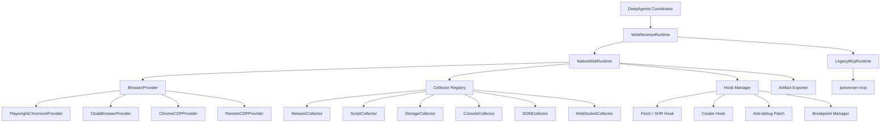

# Browser Provider Architecture and MCP Deprecation Boundary

## 1. Decision

`reverse-deepagent` should not treat MCP as the core Web runtime abstraction.

The long-term Web runtime boundary is:

```text
DeepAgents coordinator
  -> WebReverseRuntime
    -> Native Web Runtime
      -> BrowserProvider
      -> Collectors
      -> Hook / Debug managers
      -> Artifact exporters
```

`jsreverser-mcp` remains useful as a compatibility backend while native browser capabilities are being built, but it is not the architecture center. The replaceable module is the browser provider, not MCP.

## 2. Why MCP must move out of the core path

MCP currently bundles several responsibilities into one external process:

- browser connection and page automation,
- network capture,
- script cache and source search,
- callstack / initiator lookup,
- hooks and breakpoints,
- WebSocket inspection,
- report / export helpers,
- optional AI-enhanced analysis.

That is convenient for a prototype, but it is a migration liability:

| Problem | Impact |
| --- | --- |
| External stdio process | Harder local setup, harder CI, more failure modes. |
| Tool-name coupling | Upper layers start depending on MCP tool names instead of stable project contracts. |
| Browser coupling | Chrome DevTools session assumptions leak into runtime orchestration. |
| Weak portability | A new machine needs `jsreverser-mcp`, Chrome, CDP port, and matching MCP semantics. |
| Feature bundling | It is hard to replace only the browser while keeping collectors stable. |

The project should own its Web evidence model and browser instrumentation. MCP can stay as a legacy backend for comparison and compatibility, but the default direction is native.

## 3. Target layering



The coordinator consumes stable project schemas:

- `TaskCard`
- `RouterResult`
- `ReconResult`
- `FinalResult`
- `RuntimeBackendCapabilities`
- `EvidenceItem`
- `RuntimeArtifactManifest`

The coordinator must not consume:

- raw MCP tool names,
- raw Playwright page objects,
- raw CDP messages,
- browser-specific profile or process details,
- target-specific cookies, tokens, or headers outside normalized evidence.

## 4. BrowserProvider contract

A browser provider owns browser lifecycle and exposes normalized sessions/pages. It does not decide reverse-engineering strategy.

Suggested minimal contract:

```python
class BrowserProvider(Protocol):
    def describe(self) -> BrowserProviderCapabilities: ...
    def start(self) -> BrowserSession: ...
    def connect(self) -> BrowserSession: ...
    def stop(self) -> None: ...
    def is_available(self) -> bool: ...
```

Suggested session/page contract:

```python
class BrowserSession(Protocol):
    provider_id: str
    def list_pages(self) -> list[BrowserPageRef]: ...
    def new_page(self, url: str | None = None) -> BrowserPage: ...
    def get_active_page(self) -> BrowserPage | None: ...
    def close(self) -> None: ...

class BrowserPage(Protocol):
    url: str
    def goto(self, url: str, timeout: float | None = None) -> None: ...
    def title(self) -> str: ...
    def content(self) -> str: ...
    def evaluate(self, expression: str) -> Any: ...
    def screenshot(self, path: str | None = None) -> bytes | None: ...
    def cdp_session(self) -> BrowserCDPSession | None: ...
```

`cdp_session()` is optional. Some providers can support strong Playwright APIs without exposing full CDP control.

## 5. BrowserProvider capability metadata

Every provider should expose non-secret capability metadata. Example fields:

```python
class BrowserProviderCapabilities(SchemaBaseModel):
    provider_id: str
    display_name: str
    engine: str
    transport: str
    supports_launch: bool
    supports_connect: bool
    supports_persistent_context: bool
    supports_cdp: bool
    supports_playwright_api: bool
    supports_proxy: bool
    supports_stealth: bool
    supports_humanize: bool
    supports_extensions: bool
    supports_network_events: bool
    supports_response_body: bool
    supports_request_initiator: bool
    supports_script_source: bool
    supports_websocket_frames: bool
    supports_breakpoints: bool
    supports_runtime_eval: bool
```

This lets routing and doctor commands answer precise questions:

- Can this provider preserve login state?
- Can it collect request initiators?
- Can it expose script source?
- Can it run breakpoints?
- Is it stealth-oriented?

## 6. Provider candidates

| Provider | Purpose | Notes |
| --- | --- | --- |
| `playwright-chromium` | Stable native default and CI baseline. | Good first native provider; lower stealth. |
| `cloakbrowser` | Stealth-oriented browser provider. | Preferred for fingerprint-sensitive targets; supports launch / persistent context and CDP connect to an existing CloakBrowser or cloakserve endpoint. |
| `chrome-cdp` | Connect to local Chrome DevTools endpoint. | Good for migration and local debugging. |
| `remote-cdp` | Connect to browserless, Docker, remote Chrome, or `cloakserve`. | Good for self-hosted runner isolation. |
| `legacy-mcp` | Existing JSReverser MCP adapter. | Compatibility only; not the default long-term path. |

## 7. CloakBrowser role

CloakBrowser should implement `BrowserProvider`, not replace the whole runtime.

Target shape:

```text
CloakBrowserProvider
  -> Playwright-compatible BrowserSession
    -> shared native collectors
```

That lets `cloakbrowser` and `playwright-chromium` reuse the same collector stack. The browser becomes replaceable without rewriting recon logic.

Important constraints:

- Keep `cloakbrowser` as an optional dependency.
- Do not commit or redistribute CloakBrowser binaries in this repository.
- Prefer persistent profile support for login-state workflows.
- Prefer native CloakBrowser API for humanized behavior; CDP-only connections may not inherit all wrapper-level humanization.
- Treat `cloakserve` / remote CDP as an optional deployment mode: use `--browser cloakbrowser --browser-url ...` when preserving CloakBrowser provider metadata matters, or `remote-cdp` for a generic CDP endpoint.

## 8. Native collectors

Collectors are project-owned modules. They should emit normalized evidence and artifacts independent of browser provider.

Initial collectors:

| Collector | Output |
| --- | --- |
| `DOMCollector` | DOM tree summary, visible text, selector hints. |
| `StorageCollector` | Cookies, localStorage, sessionStorage, selected navigator/runtime context. |
| `ConsoleCollector` | Console logs, warnings, errors. |
| `NetworkCollector` | Request/response samples, headers, status, timings, optional body metadata. |
| `ScriptCollector` | Script URLs, script IDs, source cache, keyword search hits, source snippets. |
| `WebSocketCollector` | WebSocket URLs, frame metadata, payload samples when safe. |
| `ScreenshotCollector` | Page screenshots for visual verification. |

Advanced collectors can use CDP when available and gracefully degrade to Playwright events when not.

## 9. Hook and debug managers

Hooks and debugging should also be project-owned:

| Manager | Purpose |
| --- | --- |
| `FetchXhrHook` | Capture request parameters and response metadata at runtime. |
| `CookieHook` | Observe cookie writes and auth-related mutations. |
| `WebSocketHook` | Capture app-level WebSocket send/receive when CDP frame data is insufficient. |
| `AntiDebugPatch` | Minimal patches for `debugger`, `console.clear`, redirect traps, and DevTools-size checks. |
| `BreakpointManager` | Provider-neutral CDP breakpoint setup behind capability checks, including opt-in paused callframe evaluation. |

Current baseline supports explicit `apply_minimal_protection` breakpoint requests and returns `breakpoints.json`, paused snapshot, callframe, and optional callframe-evaluation artifact refs; default recon must not set breakpoints implicitly.

## 10. NativeWebRuntime target

`NativeWebRuntime` should be the new Web default once it has enough parity.

Suggested construction:

```python
runtime = NativeWebRuntime(
    browser_provider=browser_registry.create("cloakbrowser", config=cloak_config),
    collectors=collector_registry.default_for(provider_capabilities),
    hook_manager=BrowserHookManager(...),
)
```

CLI direction:

```bash
reverse-agent-demo \
  --runtime native-web \
  --browser cloakbrowser \
  --task-text "https://example.com 找 sign 入口"
```

Current compatibility path:

```bash
reverse-agent-demo \
  --runtime legacy-mcp \
  --ensure-chrome
```

`legacy-mcp` is the explicit compatibility backend id; `mcp` and `jsreverser-mcp` remain deprecated runnable aliases during the transition window.

## 11. Artifact compatibility

The native runtime should preserve current artifact semantics:

- `workspace/task-card.json`
- `workspace/route-decision.json`
- `workspace/recon-result.json`
- `workspace/final-result.json`
- `workspace/network-requests.json`
- `workspace/source-hits.json`
- `workspace/request-initiators.json`
- `workspace/response-bodies.json`
- `workspace/source-contexts.json`
- `workspace/websocket-frames.json`
- `workspace/runtime-context.json`
- `workspace/dom-snapshot.json`
- `workspace/script-inventory.json`
- `workspace/console-messages.json`
- `workspace/navigation-events.json`
- `workspace/function-candidates.json`
- `workspace/function-validations.json`
- `workspace/function-validation-summary.json`
- `workspace/debugger-paused.json`
- `workspace/callframes.json`
- `workspace/callframe-evaluations.json`
- `workspace/debugger-actions.json`
- `workspace/debugger-session.json`
- `workspace/debugger-timeline.json`
- `workspace/backend-artifact-manifest.json`
- `reports/demo-final-result.json`
- `reports/demo-final-report.md`

Downstream rebuild/replay/report code should not care whether evidence came from MCP, Playwright, CloakBrowser, or remote CDP.

Native BrowserProvider-backed manifest entries should include non-secret `browser_provider` and `browser_provider_transport` metadata when available. CDP-enhanced collectors subscribe before navigation and may emit `unsupported` payloads when a provider lacks CDP or when no matching event is captured; this is preferred over silently omitting artifact files.

## 11.1 CDP-enhanced collector status

Current CDP event cache support:

- `Network.requestWillBeSent` -> `workspace/request-initiators.json`.
- `Network.getResponseBody` -> `workspace/response-bodies.json` when a CDP request id is available.
- `Debugger.scriptParsed` + `Debugger.getScriptSource` -> `workspace/source-contexts.json`.
- `Network.webSocketFrameSent` / `Network.webSocketFrameReceived` -> `workspace/websocket-frames.json`.

The collector attaches before navigation in `NativeWebRuntime` so event-backed caches can observe page load and runtime activity. Real browser smoke remains provider/environment gated.

## 11.2 Hook manager status

Current hook baseline support:

- fetch wrapper records sanitized URL and method into `workspace/hook-timeline.json`.
- XHR `open` / `send` wrapper records sanitized URL, method, and body type.
- cookie setter wrapper records cookie names and value sizes, not raw cookie values.
- minimal anti-debug patch disables `console.clear` and emits blocked clear events.
- explicit breakpoint requests can set `Debugger.setBreakpointByUrl`, optionally trigger a runtime expression, capture `Debugger.paused`, normalize callframes, run explicit `Debugger.evaluateOnCallFrame` expressions, run opt-in `Debugger.stepOver` / `Debugger.stepInto` / `Debugger.stepOut` / `Debugger.resume` control actions, emit a paused-session snapshot with selected callFrame metadata, and auto-resume when no explicit debugger action already resumed execution.

Cross-request paused session lifecycle and finer-grained side-effectful mutation audit remain capability-gated future work; they should not be implemented by leaking raw CDP details into the coordinator.

## 11.3 Native candidate validation status

`NativeWebRuntime` now builds candidate function cards from project-owned script inventory and validates them with provider-neutral page runtime evaluation when the selected BrowserProvider exposes `supports_runtime_eval=true`. When an explicit breakpoint trigger expression is supplied, the breakpoint manager can also capture a paused snapshot and normalized callframes, run opt-in callframe evaluations, then auto-resume the page if requested.

Current baseline emits:

- `workspace/function-candidates.json`
- `workspace/function-validations.json`
- `workspace/function-validation-summary.json`
- `workspace/debugger-paused.json`
- `workspace/callframes.json`
- `workspace/callframe-evaluations.json` when explicit `callframe_evaluations` / `evaluate_on_callframe` expressions are provided.
- `workspace/debugger-actions.json` when explicit `debugger_actions` / `pause_actions` are provided.
- `workspace/debugger-session.json` with session id, selected callFrame, pause lifecycle, and event summaries.
- `workspace/debugger-timeline.json` with ordered breakpoint set / trigger / pause / evaluation / action / resume entries for single-run debugger audit.

This is enough for fixture-level runtime/replay validation and a basic breakpoint paused/callframe/evaluateOnCallFrame/step/session smoke path with the existing artifact contract. The current callframe evaluation baseline defaults to `read_only`, passes `throwOnSideEffect` to CDP, records side-effect risk metadata, and blocks obvious high-risk mutation expressions unless `allow_callframe_side_effects` is explicitly enabled. It is still intentionally narrower than the legacy MCP path: cross-request paused session lifecycle, fine-grained mutation auditing, cross-request timeline continuation, and target-specific function hooks remain separate capability-gated follow-up work.

## 12. Implementation status

Current implementation status:

| Layer | Status | Evidence |
| --- | --- | --- |
| BrowserProvider capability schema | Implemented | `src/reverse_deepagent/browser/capabilities.py` |
| BrowserProvider / BrowserSession / BrowserPage Protocols | Implemented | `src/reverse_deepagent/browser/base.py` |
| BrowserProvider registry | Implemented | `src/reverse_deepagent/browser/registry.py` |
| Native collectors | Baseline implemented | `src/reverse_deepagent/browser/collectors/` |
| Playwright provider | Skeleton implemented | `src/reverse_deepagent/browser/providers/playwright_chromium.py` |
| CloakBrowser provider | Skeleton implemented | `src/reverse_deepagent/browser/providers/cloakbrowser.py`, `docs/runtime/cloakbrowser-provider.md` |
| Remote CDP provider | Implemented | `src/reverse_deepagent/browser/providers/remote_cdp.py`, `tests/test_remote_cdp_provider.py` |
| NativeWebRuntime | Native collectors, hook baseline, runtime-eval candidate validation, and paused/callframe breakpoint snapshot implemented | `src/reverse_deepagent/adapters/native_web.py`, `src/reverse_deepagent/browser/hooks/` |
| MCP legacy alias | Implemented | `legacy-mcp` canonical id with `mcp` / `jsreverser-mcp` aliases |

The contract layer is intentionally side-effect free. Listing provider metadata must not launch browsers, download binaries, start MCP, or connect to external services. CloakBrowser-specific operational notes live in `docs/runtime/cloakbrowser-provider.md`.

## 13. Deprecation posture

Use these terms consistently:

- `native-web`: preferred Web runtime family.
- `browser-provider`: replaceable browser lifecycle and page/session implementation.
- `legacy-mcp`: compatibility runtime backed by `jsreverser-mcp`.
- `mcp` / `jsreverser-mcp`: deprecated temporary aliases to `legacy-mcp` until CLI compatibility can be broken.

CLI entrypoints should emit a deprecation warning when a user explicitly selects `--runtime mcp` or `--runtime jsreverser-mcp`; doctor keeps `--check-mcp` only as a deprecated alias for `--legacy-mcp`. Do not describe MCP as the default Web runtime in new docs, scripts, workflows, or examples.
