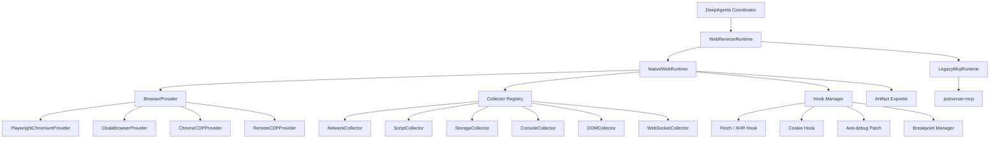

# Browser Provider Architecture and MCP Deprecation Boundary

## 1. Decision

`reverse-deepagent` should not treat MCP as the core Web runtime abstraction.

The long-term Web runtime boundary is:

```text
DeepAgents coordinator
  -> WebReverseRuntime
    -> Native Web Runtime
      -> BrowserProvider
      -> Collectors
      -> Hook / Debug managers
      -> Artifact exporters
```

`jsreverser-mcp` remains useful as a compatibility backend while native browser capabilities are being built, but it is not the architecture center. The replaceable module is the browser provider, not MCP.

## 2. Why MCP must move out of the core path

MCP currently bundles several responsibilities into one external process:

- browser connection and page automation,
- network capture,
- script cache and source search,
- callstack / initiator lookup,
- hooks and breakpoints,
- WebSocket inspection,
- report / export helpers,
- optional AI-enhanced analysis.

That is convenient for a prototype, but it is a migration liability:

| Problem | Impact |
| --- | --- |
| External stdio process | Harder local setup, harder CI, more failure modes. |
| Tool-name coupling | Upper layers start depending on MCP tool names instead of stable project contracts. |
| Browser coupling | Chrome DevTools session assumptions leak into runtime orchestration. |
| Weak portability | A new machine needs `jsreverser-mcp`, Chrome, CDP port, and matching MCP semantics. |
| Feature bundling | It is hard to replace only the browser while keeping collectors stable. |

The project should own its Web evidence model and browser instrumentation. MCP can stay as a legacy backend for comparison and compatibility, but the default direction is native.

## 3. Target layering



The coordinator consumes stable project schemas:

- `TaskCard`
- `RouterResult`
- `ReconResult`
- `FinalResult`
- `RuntimeBackendCapabilities`
- `EvidenceItem`
- `RuntimeArtifactManifest`

The coordinator must not consume:

- raw MCP tool names,
- raw Playwright page objects,
- raw CDP messages,
- browser-specific profile or process details,
- target-specific cookies, tokens, or headers outside normalized evidence.

## 4. BrowserProvider contract

A browser provider owns browser lifecycle and exposes normalized sessions/pages. It does not decide reverse-engineering strategy.

Suggested minimal contract:

```python
class BrowserProvider(Protocol):
    def describe(self) -> BrowserProviderCapabilities: ...
    def start(self) -> BrowserSession: ...
    def connect(self) -> BrowserSession: ...
    def stop(self) -> None: ...
    def is_available(self) -> bool: ...
```

Suggested session/page contract:

```python
class BrowserSession(Protocol):
    provider_id: str
    def list_pages(self) -> list[BrowserPageRef]: ...
    def new_page(self, url: str | None = None) -> BrowserPage: ...
    def get_active_page(self) -> BrowserPage | None: ...
    def close(self) -> None: ...

class BrowserPage(Protocol):
    url: str
    def goto(self, url: str, timeout: float | None = None) -> None: ...
    def title(self) -> str: ...
    def content(self) -> str: ...
    def evaluate(self, expression: str) -> Any: ...
    def screenshot(self, path: str | None = None) -> bytes | None: ...
    def cdp_session(self) -> BrowserCDPSession | None: ...
```

`cdp_session()` is optional. Some providers can support strong Playwright APIs without exposing full CDP control.

## 5. BrowserProvider capability metadata

Every provider should expose non-secret capability metadata. Example fields:

```python
class BrowserProviderCapabilities(SchemaBaseModel):
    provider_id: str
    display_name: str
    engine: str
    transport: str
    supports_launch: bool
    supports_connect: bool
    supports_persistent_context: bool
    supports_cdp: bool
    supports_playwright_api: bool
    supports_proxy: bool
    supports_stealth: bool
    supports_humanize: bool
    supports_extensions: bool
    supports_network_events: bool
    supports_response_body: bool
    supports_request_initiator: bool
    supports_script_source: bool
    supports_websocket_frames: bool
    supports_breakpoints: bool
    supports_runtime_eval: bool
```

This lets routing and doctor commands answer precise questions:

- Can this provider preserve login state?
- Can it collect request initiators?
- Can it expose script source?
- Can it run breakpoints?
- Is it stealth-oriented?

## 6. Provider candidates

| Provider | Purpose | Notes |
| --- | --- | --- |
| `playwright-chromium` | Stable native default and CI baseline. | Good first native provider; lower stealth. |
| `cloakbrowser` | Stealth-oriented browser provider. | Preferred for fingerprint-sensitive targets; optional dependency due binary and license constraints. |
| `chrome-cdp` | Connect to local Chrome DevTools endpoint. | Good for migration and local debugging. |
| `remote-cdp` | Connect to browserless, Docker, remote Chrome, or `cloakserve`. | Good for self-hosted runner isolation. |
| `legacy-mcp` | Existing JSReverser MCP adapter. | Compatibility only; not the default long-term path. |

## 7. CloakBrowser role

CloakBrowser should implement `BrowserProvider`, not replace the whole runtime.

Target shape:

```text
CloakBrowserProvider
  -> Playwright-compatible BrowserSession
    -> shared native collectors
```

That lets `cloakbrowser` and `playwright-chromium` reuse the same collector stack. The browser becomes replaceable without rewriting recon logic.

Important constraints:

- Keep `cloakbrowser` as an optional dependency.
- Do not commit or redistribute CloakBrowser binaries in this repository.
- Prefer persistent profile support for login-state workflows.
- Prefer native CloakBrowser API for humanized behavior; CDP-only connections may not inherit all wrapper-level humanization.
- Treat `cloakserve` / remote CDP as an optional deployment mode, not the primary abstraction.

## 8. Native collectors

Collectors are project-owned modules. They should emit normalized evidence and artifacts independent of browser provider.

Initial collectors:

| Collector | Output |
| --- | --- |
| `DOMCollector` | DOM tree summary, visible text, selector hints. |
| `StorageCollector` | Cookies, localStorage, sessionStorage, selected navigator/runtime context. |
| `ConsoleCollector` | Console logs, warnings, errors. |
| `NetworkCollector` | Request/response samples, headers, status, timings, optional body metadata. |
| `ScriptCollector` | Script URLs, script IDs, source cache, keyword search hits, source snippets. |
| `WebSocketCollector` | WebSocket URLs, frame metadata, payload samples when safe. |
| `ScreenshotCollector` | Page screenshots for visual verification. |

Advanced collectors can use CDP when available and gracefully degrade to Playwright events when not.

## 9. Hook and debug managers

Hooks and debugging should also be project-owned:

| Manager | Purpose |
| --- | --- |
| `FetchXhrHook` | Capture request parameters and response metadata at runtime. |
| `CookieHook` | Observe cookie writes and auth-related mutations. |
| `WebSocketHook` | Capture app-level WebSocket send/receive when CDP frame data is insufficient. |
| `AntiDebugPatch` | Minimal patches for `debugger`, `console.clear`, redirect traps, and DevTools-size checks. |
| `BreakpointManager` | CDP-backed breakpoints and callframe evaluation when provider supports debugger APIs. |

Phase 1 does not need full breakpoint parity. Basic recon should land first.

## 10. NativeWebRuntime target

`NativeWebRuntime` should be the new Web default once it has enough parity.

Suggested construction:

```python
runtime = NativeWebRuntime(
    browser_provider=browser_registry.create("cloakbrowser", config=cloak_config),
    collectors=collector_registry.default_for(provider_capabilities),
    hook_manager=BrowserHookManager(...),
)
```

CLI direction:

```bash
reverse-agent-demo \
  --runtime native-web \
  --browser cloakbrowser \
  --task-text "https://example.com 找 sign 入口"
```

Compatibility path:

```bash
reverse-agent-demo \
  --runtime legacy-mcp \
  --ensure-chrome
```

## 11. Artifact compatibility

The native runtime should preserve current artifact semantics:

- `workspace/task-card.json`
- `workspace/route-decision.json`
- `workspace/recon-result.json`
- `workspace/final-result.json`
- `workspace/network-requests.json`
- `workspace/source-hits.json`
- `workspace/request-initiators.json`
- `workspace/source-contexts.json`
- `workspace/runtime-context.json`
- `workspace/backend-artifact-manifest.json`
- `reports/demo-final-result.json`
- `reports/demo-final-report.md`

Downstream rebuild/replay/report code should not care whether evidence came from MCP, Playwright, CloakBrowser, or remote CDP.

## 12. Implementation status

Current implementation status:

| Layer | Status | Evidence |
| --- | --- | --- |
| BrowserProvider capability schema | Implemented | `src/reverse_deepagent/browser/capabilities.py` |
| BrowserProvider / BrowserSession / BrowserPage Protocols | Implemented | `src/reverse_deepagent/browser/base.py` |
| BrowserProvider registry | Implemented | `src/reverse_deepagent/browser/registry.py` |
| Native collectors | Planned | Phase 3 in migration plan |
| Playwright provider | Skeleton implemented | `src/reverse_deepagent/browser/providers/playwright_chromium.py` |
| CloakBrowser provider | Planned | Phase 5 in migration plan |
| NativeWebRuntime | Planned | Phase 4 in migration plan |
| MCP legacy alias | Planned | Phase 8 in migration plan |

The contract layer is intentionally side-effect free. Listing provider metadata must not launch browsers, download binaries, start MCP, or connect to external services.

## 13. Deprecation posture

Use these terms consistently:

- `native-web`: preferred Web runtime family.
- `browser-provider`: replaceable browser lifecycle and page/session implementation.
- `legacy-mcp`: compatibility runtime backed by `jsreverser-mcp`.
- `mcp`: temporary alias to `legacy-mcp` until CLI compatibility can be broken.

Do not describe MCP as the default Web runtime in new docs.
