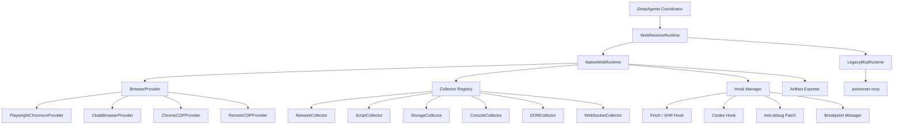

# Browser Provider Architecture and MCP Deprecation Boundary

## 1. Decision

`reverse-deepagent` should not treat MCP as the core Web runtime abstraction.

The long-term Web runtime boundary is:

```text
DeepAgents coordinator
  -> WebReverseRuntime
    -> Native Web Runtime
      -> BrowserProvider
      -> Collectors
      -> Hook / Debug managers
      -> Artifact exporters
```

`jsreverser-mcp` remains useful as a compatibility backend while native browser capabilities are being built, but it is not the architecture center. The replaceable module is the browser provider, not MCP.

## 2. Why MCP must move out of the core path

MCP currently bundles several responsibilities into one external process:

- browser connection and page automation,
- network capture,
- script cache and source search,
- callstack / initiator lookup,
- hooks and breakpoints,
- WebSocket inspection,
- report / export helpers,
- optional AI-enhanced analysis.

That is convenient for a prototype, but it is a migration liability:

| Problem | Impact |
| --- | --- |
| External stdio process | Harder local setup, harder CI, more failure modes. |
| Tool-name coupling | Upper layers start depending on MCP tool names instead of stable project contracts. |
| Browser coupling | Chrome DevTools session assumptions leak into runtime orchestration. |
| Weak portability | A new machine needs `jsreverser-mcp`, Chrome, CDP port, and matching MCP semantics. |
| Feature bundling | It is hard to replace only the browser while keeping collectors stable. |

The project should own its Web evidence model and browser instrumentation. MCP can stay as a legacy backend for comparison and compatibility, but the default direction is native.

## 3. Target layering



The coordinator consumes stable project schemas:

- `TaskCard`
- `RouterResult`
- `ReconResult`
- `FinalResult`
- `RuntimeBackendCapabilities`
- `EvidenceItem`
- `RuntimeArtifactManifest`

The coordinator must not consume:

- raw MCP tool names,
- raw Playwright page objects,
- raw CDP messages,
- browser-specific profile or process details,
- target-specific cookies, tokens, or headers outside normalized evidence.

## 4. BrowserProvider contract

A browser provider owns browser lifecycle and exposes normalized sessions/pages. It does not decide reverse-engineering strategy.

Suggested minimal contract:

```python
class BrowserProvider(Protocol):
    def describe(self) -> BrowserProviderCapabilities: ...
    def start(self) -> BrowserSession: ...
    def connect(self) -> BrowserSession: ...
    def stop(self) -> None: ...
    def is_available(self) -> bool: ...
```

Suggested session/page contract:

```python
class BrowserSession(Protocol):
    provider_id: str
    def list_pages(self) -> list[BrowserPageRef]: ...
    def new_page(self, url: str | None = None) -> BrowserPage: ...
    def get_active_page(self) -> BrowserPage | None: ...
    def close(self) -> None: ...

class BrowserPage(Protocol):
    url: str
    def goto(self, url: str, timeout: float | None = None) -> None: ...
    def title(self) -> str: ...
    def content(self) -> str: ...
    def evaluate(self, expression: str) -> Any: ...
    def screenshot(self, path: str | None = None) -> bytes | None: ...
    def cdp_session(self) -> BrowserCDPSession | None: ...
```

`cdp_session()` is optional. Some providers can support strong Playwright APIs without exposing full CDP control.

## 5. BrowserProvider capability metadata

Every provider should expose non-secret capability metadata. Example fields:

```python
class BrowserProviderCapabilities(SchemaBaseModel):
    provider_id: str
    display_name: str
    engine: str
    transport: str
    supports_launch: bool
    supports_connect: bool
    supports_persistent_context: bool
    supports_cdp: bool
    supports_playwright_api: bool
    supports_proxy: bool
    supports_stealth: bool
    supports_humanize: bool
    supports_extensions: bool
    supports_network_events: bool
    supports_response_body: bool
    supports_request_initiator: bool
    supports_script_source: bool
    supports_websocket_frames: bool
    supports_breakpoints: bool
    supports_runtime_eval: bool
    production_readiness: dict[str, Any]
```

This lets routing and doctor commands answer precise questions:

- Can this provider preserve login state?
- Can it collect request initiators?
- Can it expose script source?
- Can it run breakpoints?
- Is it stealth-oriented?

`production_readiness` is not a runtime smoke result. It is a non-secret,
metadata-only review contract for provider operations: health-check mode,
profile lifecycle, proxy policy, extension policy, humanize policy, session
recovery, intended use, and side-effect boundary. Provider registration and
doctor matrix output must be able to evaluate this field without importing an
optional browser SDK, invoking a provider factory, probing CDP, launching a
browser, or calling MCP.

## 5.1 BrowserProvider registry, smoke matrix, and lifecycle baseline

`reverse_deepagent.browser.registry` defines `BrowserProviderRegistry`, `BrowserProviderRegistration`, and the `reverse_deepagent.browser_providers` entry point group. Built-in registrations cover `playwright-chromium`, `cloakbrowser`, and `remote-cdp`; external packages may return one registration or an iterable of registrations without starting a browser. `NativeWebRuntime` resolves provider ids and aliases through this registry instead of hard-coding provider-specific branches in the runtime factory.

`reverse_deepagent.browser.smoke` defines the reusable BrowserProvider smoke matrix contract. The default built-in matrix covers:

- `playwright-chromium`
- `cloakbrowser`
- `remote-cdp`

The matrix records standard capability flags, supported modes, metadata-only compatibility checks, production readiness checks, and lifecycle stages:

```text
configured -> capability_described -> availability_checked -> session_start_requested -> session_opened -> page_ready -> session_closed
```

The default matrix path is metadata-only and side-effect free: it reads provider registration metadata and `describe()` output, runs a serializable compatibility rule catalog such as `breakpoints_require_cdp`, `response_body_requires_network_or_cdp`, `persistent_context_requires_lifecycle`, `humanize_requires_page_control_transport`, `mobile_emulation_requires_page_control_transport`, `extensions_require_launch_or_persistent_context`, and `proxy_requires_launch_or_managed_browser`, and evaluates `production_readiness` metadata into `production-ready`, `review-required`, or `metadata-incomplete`. It does not call provider factories for external plugins, import optional browser binaries, probe remote CDP endpoints, launch browsers, or touch MCP. Matrix output includes `compatibility_rules`, per-provider `rule_count`, `evaluated_rules`, `production_readiness_version`, per-provider readiness checks, and readiness summary counts so provider plugins can review capability and operational drift without starting a browser. The `2026-06-05.production-readiness-v4` catalog adds provider-specific `required_metadata_keys` so missing CloakBrowser stealth policy, Remote CDP endpoint security policy, hosted-CDP allocation / endpoint policy, or Browserless account / endpoint boundary policy is classified as `metadata-incomplete`; value drift with those fields present remains a review warning. Availability checks and launch smoke are explicit knobs. Doctor exposes this through:

```bash
reverse-agent-doctor --browser-provider-matrix
```

Single-provider doctor checks keep the existing `browser_provider` shape and add `browser_provider.smoke_matrix`; explicit `--launch-browser-smoke` is still the only path that can open a real provider session. `reverse-agent-browser-provider-smoke` now writes the same single-provider evidence shape to `workspace/browser-provider-smoke.json`: default mode is registry metadata-only and does not invoke provider factories, while `--include-availability` / `--launch-browser-smoke` are explicit side-effect knobs. A reviewed smoke JSON can be attached to a Web pipeline through `reverse-agent-demo --browser-provider-smoke-json <path>`; this path only reads an existing UTF-8 JSON object and includes it in `workspace/browser-provider-smoke.json`, `exports/artifact-index.json`, and `workspace/backend-artifact-manifest.json`. During attachment the coordinator appends `attachment_acceptance`, a metadata-only gate that checks schema, `ok`, provider match, side-effect boundaries, and launch-smoke consistency; metadata-only evidence remains attachable but is not marked as accepted runtime launch smoke. It does not generate smoke, call provider factories, check availability, launch browsers, probe CDP endpoints, or call MCP. The workspace contract indexes that path as `/workspace/browser/browser-provider-smoke.json` without migrating existing outputs.

## 5.2 Browser Runtime Subagent baseline

`browser_runtime` is now an implemented DeepAgents subagent boundary for BrowserProvider-facing work. It exposes side-effect-free provider metadata tools by default:

- `list_browser_providers` returns the registry-driven provider matrix, entry point group, registration metadata, registered provider ids, and side-effect policy.
- `describe_browser_provider` resolves a provider id or alias and returns capability metadata without launching a browser, probing CDP, invoking external provider factories, or touching MCP.
- `ensure_browser_session` is only attached when a Web runtime object is provided, so session readiness checks stay explicit and runtime-scoped.

This subagent does not perform Web recon, source search, network sampling, hook installation, breakpoint work, or protection patching. Those responsibilities remain with `web_recon` and `protector`; `browser_runtime` only owns provider capability discovery and browser session health boundaries.

## 5.3 Debugger Subagent baseline

`debugger` is now an implemented DeepAgents subagent boundary for debugger / paused-session artifact review. It exposes `review_debugger_artifacts`, a read-only tool that consumes existing debugger artifacts such as `debugger-session.json`, `debugger-timeline.json`, `debugger-paused.json`, `callframes.json`, `callframe-evaluations.json`, `mutation-audit.json`, and `debugger-actions.json`.

The debugger tool summarizes paused-session status, continuation preflight source / status / requested action, target attach readiness source / URL correlation / attachability / callframe recovery, cross-process execution plan readiness / review gates / executor boundary, reviewed attach-probe status / target id / attach-detach methods, callframe counts, top callframes, callframe evaluations, mutation audit records, debugger actions, and timeline event counts. It detects action-blocked durable snapshots, blocked target attach readiness proofs, attach-ready-but-executor-missing states, cross-process-plan-ready-but-executor-missing states, attach-probe review / blocker / failure states, attach-probe-ready-but-live-callframe-recovery-missing states, missing artifacts, unavailable paused sessions, debugger failures, and paused sessions without callframes. The review tool itself remains read-only: it does not connect CDP, attach targets, resume, step, evaluate callframes, install breakpoints or hooks, write debugger artifacts, mutate runtime state, or trigger delivery.

## 5.4 Hook Subagent baseline

`hook` is now an implemented DeepAgents subagent boundary for hook artifact review. It exposes `review_hook_artifacts`, a read-only tool that consumes existing function hook, module hook, async chunk load, async chunk traversal graph / workflow plan / workflow execution / bounded loop plan / bounded loop execution / recursive traversal plan / recursive followup / recursive next-loop execution, async chunk module diff, custom-loader traversal plan / traversal graph / continuation workflow / continuation journal / continuation execution / execution preflight / execution result, Module Federation get/init plan / probe result / factory invoke result / export hook plan / traversal graph / traversal workflow plan / traversal workflow execution / recursive traversal plan / recursive traversal followup / recursive traversal execution, recursive continuation journal / checkpoint, recursive continuation readiness descriptor, generic hook timeline, source-logpoint, and hook candidate artifacts such as `function-hooks.json`, `function-hook-timeline.json`, `module-hooks.json`, `module-hook-timeline.json`, `async-chunk-load-plan.json`, `async-chunk-load-result.json`, `async-chunk-traversal-graph.json`, `async-chunk-traversal-workflow-plan.json`, `async-chunk-traversal-workflow-execution.json`, `async-chunk-traversal-loop-plan.json`, `async-chunk-traversal-loop-execution.json`, `async-chunk-recursive-traversal-plan.json`, `async-chunk-recursive-traversal-followup.json`, `async-chunk-recursive-traversal-execution.json`, `async-chunk-module-diff.json`, `custom-loader-traversal-plan.json`, `custom-loader-traversal-graph.json`, `custom-loader-continuation-workflow.json`, `custom-loader-continuation-journal.json`, `custom-loader-continuation-execution.json`, `custom-loader-execution-preflight.json`, `custom-loader-execution-result.json`, `module-federation-get-init-plan.json`, `module-federation-get-init-result.json`, `module-federation-factory-invoke-result.json`, `module-federation-export-hook-plan.json`, `module-federation-traversal-graph.json`, `module-federation-traversal-workflow-plan.json`, `module-federation-traversal-workflow-execution.json`, `module-federation-recursive-traversal-plan.json`, `module-federation-recursive-traversal-followup.json`, `module-federation-recursive-traversal-execution.json`, `module-federation-recursive-continuation-journal.json`, `module-federation-recursive-continuation-checkpoint.json`, `recursive-continuation-readiness.json`, `hook-timeline.json`, and `source-logpoints.json`.

The hook tool summarizes installed function / module hooks, async chunk load plan / result status, recursive continuation readiness status / ready systems / blocked systems, async chunk traversal graph / workflow / execution status, async chunk module diff status / hook candidate counts, custom-loader traversal plan status / candidate and continuation counts, custom-loader continuation workflow / journal status, custom-loader execution preflight / result status, Module Federation get/init plan status / container counts, reviewed init/get probe result status, remote factory invoke export summary status, source-logpoint counts, missing targets, candidates, timeline event counts, event type counts, and installed target paths. It detects hook failures, async chunk load plans waiting for review, reviewed async chunk loads that still need module diff refresh, async chunk module diff plans waiting for review, async chunk traversal graph / workflow plans, one-step workflow execution plans, bounded loop checkpoints, recursive traversal checkpoints waiting for review, unified recursive continuation readiness descriptors waiting for review or blocked, custom-loader traversal plans waiting for review or blocked by missing candidates, continuation-aware custom-loader traversal plans that need workflow planning, custom-loader continuation workflows waiting for review, custom-loader continuation journals waiting for append review, custom-loader preflights waiting for reviewed execution, failed custom-loader executions, Module Federation get/init plans waiting for review or missing candidates, reviewed init/get probes that still require factory-invocation review, reviewed factory invokes that still require export-hook planning, export hook plans that require review, failed async chunk loads, missing hook targets, installed hooks without captured events, and candidates that have not yet been installed. It does not execute Web recon, install hooks, install breakpoints or logpoints, evaluate JavaScript, invoke target functions, load chunks, write hook artifacts, mutate runtime state, or trigger delivery.

## 5.5 Timeline Subagent baseline

`timeline` is now an implemented DeepAgents subagent boundary for flow-timeline review. It exposes `review_flow_timeline`, a read-only tool that consumes an existing `flow-timeline.json` payload and summarizes entries, source counts, correlation group readiness, stitch candidates, stitch proposals, auto-stitch dry-runs, conflict resolutions, policy decisions, materialization plans / results, and rollback plan / result counts.

The timeline tool detects pending stitch proposals, blocked policy decisions, unresolved conflicts, and materialization requests without approval. It returns `status`, `blockers`, `warnings`, `review_required_items`, `next_action`, and an explicit side-effect policy. It does not run recon, install hooks, set breakpoints, write timeline artifacts, generate `stitched-flow.json`, record review decisions, execute rollback, or trigger delivery.

## 5.6 Review Subagent baseline

`review` is now an implemented DeepAgents subagent boundary for delivery-readiness review. It exposes `evaluate_delivery_review_gate`, a read-only tool that consumes `RebuildResult` JSON plus optional `EvidencePromotionResult` JSON, delegates to `evaluate_review_gate(...)`, and returns the normalized gate result with an explicit side-effect policy. That gate tool does not write artifacts, mutate files, execute local delivery, call external delivery providers, or record approval decisions.

The same subagent also exposes `record_review_approval`, an explicit approval-audit-only ledger writer. It can write `review-approval-record.json` and append to `review-approval-ledger.json` only when called in apply mode with a reviewer and `approve_decision_record=true`; dry-run is read-only and blocked attempts write nothing. This records a manual review decision for downstream review-gated executors, but it does not materialize stitched flows, execute rollback, mutate manifests, commit transactions, perform external delivery, or create automatic approval.

This subagent owns risk / warning review hints, evidence-level review requirements, delivery gate next-action summaries, and manual decision audit records. Pending stitch proposals remain blocked with `next_action=review_stitch_proposals_before_delivery` until explicit reviewer-approved materialization data exists; the approval ledger records reviewer decisions but does not execute proposals, rollback plans, materialization plans, or delivery by itself.

## 5.7 Rebuild Subagent baseline

`rebuild` is now an implemented DeepAgents subagent boundary for rebuild generation and rebuild artifact review. It owns `build_rebuild_delivery` plus `review_rebuild_artifacts`; the former can read TaskCard / FinalResult either from JSON strings or workspace artifact refs, then writes `workspace/rebuild-plan.json` and generated rebuild files under the configured artifact root, while the latter is read-only and summarizes RebuildResult / rebuild-plan readiness, generated files, review hints, runtime-assisted recommendations, declared outputs, and next actions.

This split leaves the `delivery` subagent focused on local delivery, backend manifest mutation, recovery, transaction commit, and external delivery provider requests. Rebuild can generate and review pure / context-aware / Scrapy replay artifacts, but it does not execute local delivery, mutate manifests, publish external releases, or bypass review gates.

## 5.8 WorkspacePathResolver baseline

`WorkspacePathResolver` is now the compatibility layer between existing flat `workspace/*.json` artifacts and the DeepAgents virtual folder contract. It resolves artifacts by canonical key, legacy path, future foldered path, or `virtual://workspace/...` URI while keeping the legacy flat path authoritative by default.

The resolver introduces an opt-in dual-write writer seam. `WorkspacePathResolver(enable_dual_write=True)` returns both the legacy canonical path and foldered future path in `write_paths`; the deterministic Web and platform pipelines expose `enable_workspace_dual_write=True` to actually write both physical paths under the artifact root and emit `workspace/workspace-dual-write-plan.json` as an audit record. The legacy flat path remains authoritative, existing artifacts are not moved, and full physical migration remains a separate follow-up.

`read_workspace_artifact` is the shared resolver consumer exposed to the coordinator and read-only review / rebuild / timeline / hook / debugger subagents. It can read by artifact key, legacy path, future `/workspace/<area>/...` path, `virtual://workspace/...` URI, or artifact-root-relative fallback while reporting checked paths, `resolver_metrics`, and a read-only side-effect policy. The metrics classify ref shape, hit path kind, legacy / future path checks, future fallback, direct fallback, canonical-path authority, and missing state for migration-readiness review. The specialized read-only review helpers for flow timeline, hook artifacts, debugger artifacts, rebuild artifacts, and delivery review gate can also accept artifact-ref inputs directly and return compact `artifact_input` diagnostics. `execute_local_delivery` additionally accepts `source_artifact_ref` / `artifact_ref` in its artifact list, resolves the reviewed source path before constructing `DeliveryArtifact`, and then delegates to the unchanged dry-run / explicit-apply delivery gates. These resolver paths do not enable dual-write, change canonical paths, start browsers, or call MCP.

`audit_workspace_artifact_consumers` exposes a side-effect-free adoption matrix for the coordinator. It distinguishes resolver-ready review helpers and rebuild generation inputs, partial delivery artifact-source adoption, explicit filesystem safety boundaries such as backend manifest recovery / rollback paths, and non-workspace transaction roots. This audit is intentionally not a migration executor; it prevents resolver expansion from crossing apply-time safety gates by accident.

## 5.9 BrowserProvider plugin package template

`packages/reverse-deepagent-browser-provider-template/` is the copy-and-replace package template for external BrowserProvider integrations. It declares the `reverse_deepagent.browser_providers` entry point and returns a `BrowserProviderRegistration` for `template-browser` without calling the provider factory. The template provider is intentionally runtime-unavailable: `start()` and `connect()` raise `BrowserProviderUnavailableError` until an integrator replaces them with real launch / attach code.

`packages/reverse-deepagent-browser-provider-fixture/` is a functional external provider package rather than a template. It declares the same entry-point group for `fixture-browser`, keeps metadata loading side-effect free, delays factory invocation until explicit provider creation, and returns an in-memory provider-neutral `BrowserSession` / `BrowserPage` from `start()` and `connect()`. It does not launch a real browser, expose CDP, provide stealth behavior, or replace Playwright / CloakBrowser, but it proves that external BrowserProvider packages can be discovered, compatibility-checked, and launch-smoked without core runtime branches.

`packages/reverse-deepagent-browser-provider-hosted-cdp-template/` is a more specific template for hosted browser services, vendor anti-detect browsers, enterprise browser pools, and remote CDP brokers. It declares `hosted-cdp-template`, keeps registration metadata side-effect free, reports `review-required` production readiness, and requires an explicit `browser_url` / `cdp_browser_url` before lifecycle methods can connect. When an endpoint is provided, it delegates to the core `RemoteCDPProvider` adapter so plugin authors can smoke the BrowserProvider contract before replacing allocation / attach logic with a vendor SDK.

`packages/reverse-deepagent-browser-provider-browserless-cdp/` is the first real third-party hosted CDP provider package baseline. It declares `browserless-cdp`, keeps entry-point registration and matrix listing side-effect-free, accepts a reviewed HTTP DevTools endpoint by delegating to `RemoteCDPProvider`, and also accepts a reviewed direct browser WebSocket endpoint through a minimal Target / Page / Runtime CDP wrapper. It redacts URL credentials and query strings in capability metadata, exposes endpoint / access-material booleans instead of raw values, and requires explicit availability or launch smoke before runtime use.

These packages are part of the MCP deprecation seam: new browser integrations should land as packages that expose registration metadata and provider factories, not as new `if/else` branches in `NativeWebRuntime` or the coordinator. The hard requirements are the same as the registry contract: metadata loading is side-effect free, capability config is non-secret, optional browser SDK imports are delayed, and real launch / CDP probing only happens behind explicit runtime or doctor smoke paths.

## 5.10 ExternalDeliveryProvider plugin package template

`packages/reverse-deepagent-external-delivery-provider-template/` is the copy-and-replace package template for external delivery integrations. It declares the `reverse_deepagent.external_delivery_providers` entry point and returns an `ExternalDeliveryProviderRegistration` for `template-external-delivery` without calling the provider factory, opening sockets, importing cloud SDKs, reading credentials, uploading artifacts, or publishing releases.

The template provider intentionally never publishes externally: dry-run returns a reviewable plan for a valid local delivery package, while apply mode returns a structured blocker until an integrator replaces `deliver()` with real SDK / HTTP publication logic. New S3 / OSS / GCS / GitLab Release / internal release-system providers should start from this package, preserve dry-run side-effect freedom, keep capability metadata non-secret, and let core duplicate-guard / idempotency / review gates remain authoritative unless an explicit reviewed provider design says otherwise.

## 6. Provider candidates

| Provider | Purpose | Notes |
| --- | --- | --- |
| `playwright-chromium` | Stable native default and CI baseline. | Good first native provider; lower stealth. |
| `cloakbrowser` | Stealth-oriented browser provider. | Preferred for fingerprint-sensitive targets; supports launch / persistent context and CDP connect to an existing CloakBrowser or cloakserve endpoint. |
| `chrome-cdp` | Connect to local Chrome DevTools endpoint. | Good for migration and local debugging. |
| `remote-cdp` | Connect to browserless, Docker, remote Chrome, or `cloakserve`. | Good for self-hosted runner isolation. |
| `hosted-cdp-template` | External package seam for hosted CDP / browser-service providers. | Template only; metadata-only registration is side-effect free, explicit endpoint connect delegates to `RemoteCDPProvider` for contract smoke. |
| `browserless-cdp` | External Browserless / hosted CDP provider package. | Real provider baseline; metadata-only registration is side-effect free, explicit HTTP DevTools endpoint delegates to `RemoteCDPProvider`, explicit browser WebSocket endpoint uses Target / Page / Runtime CDP smoke. |
| `legacy-mcp` | Existing JSReverser MCP adapter. | Compatibility only; not the default long-term path. |

## 7. CloakBrowser role

CloakBrowser should implement `BrowserProvider`, not replace the whole runtime.

Target shape:

```text
CloakBrowserProvider
  -> Playwright-compatible BrowserSession
    -> shared native collectors
```

That lets `cloakbrowser` and `playwright-chromium` reuse the same collector stack. The browser becomes replaceable without rewriting recon logic.

Important constraints:

- Keep `cloakbrowser` as an optional dependency.
- Do not commit or redistribute CloakBrowser binaries in this repository.
- Prefer persistent profile support for login-state workflows.
- Prefer native CloakBrowser API for humanized behavior; CDP-only connections may not inherit all wrapper-level humanization.
- Treat `cloakserve` / remote CDP as an optional deployment mode: use `--browser cloakbrowser --browser-url ...` when preserving CloakBrowser provider metadata matters, or `remote-cdp` for a generic CDP endpoint.

## 8. Native collectors

Collectors are project-owned modules. They should emit normalized evidence and artifacts independent of browser provider.

Initial collectors:

| Collector | Output |
| --- | --- |
| `DOMCollector` | DOM tree summary, visible text, selector hints. |
| `StorageCollector` | Cookies, localStorage, sessionStorage, selected navigator/runtime context. |
| `ConsoleCollector` | Console logs, warnings, errors. |
| `NetworkCollector` | Request/response samples, headers, status, timings, optional body metadata. |
| `ScriptCollector` | Script URLs, script IDs, source cache, keyword search hits, source snippets. |
| `WebSocketCollector` | WebSocket URLs, frame metadata, payload samples when safe; CDP frame data is post-attach only, hook timeline remains the fallback, and missing pre-subscription emits structured diagnostics rather than pretending historical replay exists. |
| `ScreenshotCollector` | Page screenshots for visual verification. |

Advanced collectors can use CDP when available and gracefully degrade to Playwright events when not. CDP WebSocket frame capture must be attached before navigation or before the target socket traffic; without that pre-subscription, the collector reports `websocket_event_cache_required_before_navigation` / `websocket_event_cache_attached_no_frames_observed` style diagnostics, keeps `historical_replay_supported=false`, and recommends either pre-attaching the CDP event cache or enabling the runtime WebSocket hook.

## 9. Hook and debug managers

Hooks and debugging should also be project-owned:

| Manager | Purpose |
| --- | --- |
| `FetchXhrHook` | Capture request parameters and response metadata at runtime. |
| `CookieHook` | Observe cookie writes and auth-related mutations. |
| `WebSocketHook` | Capture app-level WebSocket send/receive when CDP frame data is insufficient. |
| `AntiDebugPatch` | Minimal patches for `debugger`, `console.clear`, redirect traps, and DevTools-size checks. |
| `BreakpointManager` | Provider-neutral CDP breakpoint setup behind capability checks, including opt-in paused callframe evaluation. |

Current baseline supports explicit `apply_minimal_protection` breakpoint requests and returns `breakpoints.json`, paused snapshot, callframe, and optional callframe-evaluation artifact refs; default recon must not set breakpoints implicitly.

## 10. NativeWebRuntime target

`NativeWebRuntime` should be the new Web default once it has enough parity.

Suggested construction:

```python
runtime = NativeWebRuntime(
    browser_provider=browser_registry.create("cloakbrowser", config=cloak_config),
    collectors=collector_registry.default_for(provider_capabilities),
    hook_manager=BrowserHookManager(...),
)
```

CLI direction:

```bash
reverse-agent-demo \
  --runtime native-web \
  --browser cloakbrowser \
  --task-text "https://example.com 找 sign 入口"
```

Current compatibility path:

```bash
reverse-agent-demo \
  --runtime legacy-mcp \
  --ensure-chrome
```

`legacy-mcp` is the explicit compatibility backend id; `mcp` and `jsreverser-mcp` remain deprecated runnable aliases during the transition window.

## 11. Artifact compatibility

The native runtime should preserve current artifact semantics:

- `workspace/task-card.json`
- `workspace/route-decision.json`
- `workspace/recon-result.json`
- `workspace/final-result.json`
- `workspace/network-requests.json`
- `workspace/source-hits.json`
- `workspace/request-initiators.json`
- `workspace/response-bodies.json`
- `workspace/source-contexts.json`
- `workspace/websocket-frames.json`
- `workspace/runtime-context.json`
- `workspace/dom-snapshot.json`
- `workspace/script-inventory.json`
- `workspace/console-messages.json`
- `workspace/navigation-events.json`
- `workspace/function-candidates.json`
- `workspace/function-validations.json`
- `workspace/function-validation-summary.json`
- `workspace/debugger-paused.json`
- `workspace/callframes.json`
- `workspace/callframe-evaluations.json`
- `workspace/debugger-actions.json`
- `workspace/debugger-session.json`
- `workspace/debugger-timeline.json`
- `workspace/backend-artifact-manifest.json`
- `reports/demo-final-result.json`
- `reports/demo-final-report.md`

Downstream rebuild/replay/report code should not care whether evidence came from MCP, Playwright, CloakBrowser, or remote CDP.

Native BrowserProvider-backed manifest entries should include non-secret `browser_provider` and `browser_provider_transport` metadata when available. CDP-enhanced collectors subscribe before navigation and may emit `unsupported` payloads when a provider lacks CDP or when no matching event is captured; this is preferred over silently omitting artifact files.

## 11.1 CDP-enhanced collector status

Current CDP event cache support:

- `Network.requestWillBeSent` -> `workspace/request-initiators.json`.
- `Network.getResponseBody` -> `workspace/response-bodies.json` when a CDP request id is available.
- `Debugger.scriptParsed` + `Debugger.getScriptSource` -> `workspace/source-contexts.json`.
- `Network.webSocketFrameSent` / `Network.webSocketFrameReceived` -> `workspace/websocket-frames.json`.

The collector attaches before navigation in `NativeWebRuntime` so event-backed caches can observe page load and runtime activity. Real browser smoke remains provider/environment gated.

## 11.2 Hook manager status

Current hook baseline support:

- fetch wrapper records sanitized URL and method into `workspace/hook-timeline.json`.
- XHR `open` / `send` wrapper records sanitized URL, method, and body type.
- cookie setter wrapper records cookie names and value sizes, not raw cookie values.
- minimal anti-debug patch disables `console.clear` and emits blocked clear events.
- target-function wrapper baseline can install around globally reachable function paths such as `window.buildSign`, capture call / return / throw events, and emit `workspace/function-hooks.json` plus `workspace/function-hook-timeline.json`.
- webpack-like module export hook baseline can install around explicit `module_id` / `export_name` pairs resolved through `window.__webpack_require__`, capture call / return / throw events, and emit `workspace/module-hooks.json` plus `workspace/module-hook-timeline.json`.
- module discovery baseline can scan project-owned script inventory for webpack-like `module.exports` export candidates, read-only introspect webpack-like `require.c` / `require.m` runtime module cache and registry data, and, when explicit `module_runtime_paths` are provided, read custom object runtimes or module federation exposed-module snapshots into `hook_kind=function-path` candidates. It also builds a read-only async chunk graph from static `import()` / `importScripts()` / webpack `require.e(...)` edges and runtime loader metadata such as `require.e` / `require.u` / `require.f` shape without calling loaders or requesting chunks. A separate `custom-loader-traversal-plan` protection request can now create `workspace/custom-loader-traversal-plan.json` from explicit custom loader candidates or chunk graph metadata, classifying arbitrary loaders, dynamic imports, module federation candidates, and webpack loaders without invoking any loader. The same artifact is continuation-aware: when prior reviewed custom-loader execution evidence and next candidates are provided, it marks already-executed loader fingerprints, enforces bounded traversal depth, and exposes review-only continuation counts without executing the next step. A separate `custom-loader-traversal-graph` protection request can consume the traversal plan plus continuation journal / prior execution evidence and emit `workspace/custom-loader-traversal-graph.json` with review-only nodes, edges, duplicate-execution detection, depth blockers, and a bounded queue for the next candidate; it does not run preflight, invoke loaders, append journals, recurse, call MCP, or touch mobile runtimes. A separate `custom-loader-traversal-workflow-plan` protection request can consume that graph and emit `workspace/custom-loader-traversal-workflow-plan.json`, composing candidate selection, continuation workflow, side-effect-free preflight, one reviewed loader step, module diff, optional hook, journal append, graph rebuild, and stop-before-next-review into a manual-checkpoint plan without executing any stage. A separate `custom-loader-traversal-workflow-execution` protection request can consume that workflow plan, select one planned step, and only with explicit stage flags delegate to continuation workflow / preflight / one-step continuation execution managers while stopping before queue advance, graph rebuild, workflow replan, or recursion. A separate `custom-loader-traversal-loop-plan` protection request can turn workflow steps into bounded reviewable loop iterations without invoking loaders or writing journals. A separate `custom-loader-traversal-loop-execution` protection request can consume that loop plan, execute at most one reviewed loop iteration through the existing traversal workflow executor, and still stop before traversal graph rebuild, workflow replan, queue advance, or recursive traversal. A separate `module-federation-get-init-plan` protection request can create `workspace/module-federation-get-init-plan.json` from explicit federation candidates or module discovery output, classifying container paths, exposed modules, function-path candidates, shared-scope mutation risk, and remote factory execution risk without calling `init()`, `get()`, or a remote factory by default. When `execute_module_federation_get_init=true` plus `review_approved=true` are both supplied, the reviewed probe may call `container.init(shareScope)` and `container.get(exposedName)` for a strict dotted container path, then record `workspace/module-federation-get-init-result.json` with factory type and shared-scope / container key diff evidence while keeping `remoteFactoryInvoked=false`. When `execute_module_federation_factory=true` / `invoke_module_federation_factory=true` plus `review_approved=true` are supplied, the reviewed factory baseline first runs the same init/get probe, then invokes the returned factory and records `workspace/module-federation-factory-invoke-result.json` with module type, export names, export previews, and `remoteCodeExecuted=true`; a separate `module-federation-export-hook-plan` protection request can consume that factory result and emit `workspace/module-federation-export-hook-plan.json` with review-only hookable export recommendations, still without installing hooks or recursively traversing remotes. Separate `module-federation-traversal-graph`, `module-federation-traversal-workflow-plan`, `module-federation-traversal-workflow-execution`, `module-federation-recursive-traversal-plan`, `module-federation-recursive-traversal-followup`, `module-federation-recursive-traversal-execution`, `module-federation-recursive-continuation-journal`, and `module-federation-recursive-continuation-checkpoint` protection requests add the reviewed federation traversal checkpoint layer: graph / workflow planning stay review-only, workflow execution handles at most one reviewed remote step through existing manager gates, recursive planning only classifies graph-rebuild / workflow-replan / next-step-review checkpoints, recursive followup may rebuild graph / replan workflow / plan the next reviewed step only with explicit review approval while still avoiding remote code execution, recursive execution may delegate one reviewed next traversal workflow step before stopping at the next recursive checkpoint, continuation journal planning may record the reviewed execution as append-only evidence plus the next graph / workflow / execution review checkpoint without executing remotes, and continuation checkpoint execution can review-gatedly perform one graph rebuild / workflow replan / next execution review preparation from the journal while still avoiding remote factory invocation, hook installation, queue advancement, MCP calls, and mobile runtime chains. A separate `async-chunk-traversal-graph` protection request can consume existing chunk graph / reviewed load / module-diff evidence and emit `workspace/async-chunk-traversal-graph.json` with review-only nodes, edges, loaded chunk markers, and a bounded queue of supported webpack runtime chunk candidates; it does not execute `require.e`, request chunks, invoke module factories, install hooks, recurse, or call MCP. A separate `async-chunk-traversal-workflow-plan` protection request can consume that graph and emit `workspace/async-chunk-traversal-workflow-plan.json`, composing candidate selection, load planning, one reviewed chunk load, module diff refresh, optional reviewed module hook, graph rebuild, and stop-before-next-review into a manual-checkpoint plan without executing any stage. A separate `async-chunk-traversal-workflow-execution` protection request can consume that workflow plan, select one planned step, and only with explicit stage flags delegate to async chunk load, module diff, and optional module hook managers while stopping before queue advance, graph rebuild, or recursion. A separate `async-chunk-traversal-loop-plan` protection request can turn workflow steps into bounded reviewable loop iterations without requesting chunks, and `async-chunk-traversal-loop-execution` can execute at most one reviewed loop iteration while stopping before graph rebuild, workflow replan, queue advance, or recursive traversal. Separate `async-chunk-recursive-traversal-plan`, `async-chunk-recursive-traversal-followup`, and `async-chunk-recursive-traversal-execution` protection requests now add the reviewed recursive checkpoint layer after a bounded loop execution: the plan classifies graph rebuild / workflow replan / next-loop review state, the followup may rebuild graph / replan workflow / plan the next bounded loop only when explicitly requested and reviewed, and the next-loop executor may delegate to one bounded loop execution before stopping at the next recursive checkpoint. A separate `async-chunk-load` protection request can create `workspace/async-chunk-load-plan.json` and, only when `execute_chunk_load=true` plus `review_approved=true` are both supplied, execute a webpack-style `require.e(chunkId)` loader and record `workspace/async-chunk-load-result.json` registry/cache diff evidence. A separate `async-chunk-module-diff` protection request can then consume the reviewed load result plus refreshed module discovery output and emit `workspace/async-chunk-module-diff.json` with added registry/cache keys, matched modules, and review-only `hook-module` candidates without loading chunks or installing hooks. These baselines still do not execute arbitrary custom loaders, dynamic `import()`, recursively traverse remotes, or automatically hook remote exports. Module discovery records are emitted through `workspace/module-registry.json` plus `workspace/module-candidates.json`; `module-export` candidates feed explicit `hook-module`, while `function-path` candidates feed explicit `hook-function`, without running in the default recon path.
- closure-scope discovery baseline can set an explicit breakpoint, trigger a pause, evaluate read-only `typeof <candidate>` expressions inside the selected callframe, emit `workspace/closure-functions.json` plus `workspace/closure-function-candidates.json`, and produce evidence for closure-bound functions. A separate `closure-wrapper-replacement-plan` / `closure-wrapper-preflight` protection request consumes those candidates and emits `workspace/closure-wrapper-replacement-plan.json` as a review-only plan without starting a browser session, evaluating JavaScript, sending CDP commands, assigning lexical bindings, installing wrappers, mutating runtime state, calling MCP, or claiming automatic wrapper hook support. A separate `closure-wrapper-assignment-safety` request consumes that ready plan and emits `workspace/closure-wrapper-assignment-safety.json` as a review-only static proof that the selected closure-scope candidate, safe identifier, stable callframe id, `typeof` lexical evidence, supported strategy descriptor, install-supported `log-only-call-through` strategy, restore-after-execution expectation, review gate, and same-process retained-pause scope are internally consistent; it does not execute a runtime mutability probe, evaluate JavaScript, send CDP commands, install wrappers, mutate runtime state, call MCP, or touch mobile runtimes. A separate `closure-wrapper-runtime-mutability-preflight` request consumes the assignment safety proof plus a same-process retained `pause_session_id` and emits `workspace/closure-wrapper-runtime-mutability-preflight.json` as a review-only plan for a side-effecting runtime mutability probe; it does not evaluate JavaScript, send CDP commands, install wrappers, mutate runtime state, call MCP, or prove runtime mutability. A separate `closure-wrapper-runtime-mutability-result` request can consume that preflight and, only with `execute_closure_wrapper_runtime_mutability_probe=true` plus `review_approved=true`, delegate one `allow_side_effects` same-process `Debugger.evaluateOnCallFrame` call through `BreakpointManager`; it temporarily assigns the closure binding to a probe wrapper, immediately restores the original function, emits `workspace/closure-wrapper-runtime-mutability-result.json`, and records mutation-audit metadata without installing a durable wrapper or invoking the target function. A separate `closure-wrapper-replacement-execution` protection request can then consume a ready plan, the assignment safety proof, plus a same-process retained `pause_session_id`; when `require_closure_wrapper_runtime_mutability_result=true`, it also requires a matching proven `closure-wrapper-runtime-mutability-result` whose temporary probe executed, restored the original binding, and left no durable wrapper installed. Only with `execute_closure_wrapper_replacement=true` and `review_approved=true` it delegates one `allow_side_effects` `Debugger.evaluateOnCallFrame` call through `BreakpointManager`, installs a narrow `log-only-call-through` wrapper, emits strategy descriptor metadata in `workspace/closure-wrapper-replacement-execution.json`, `workspace/closure-wrapper-restore-plan.json`, and mutation audit metadata. Other catalogued strategies such as `arg-preview`, `return-preview`, `throw-preview`, and `blocked-mutation-plan` are descriptor-only / plan-only and are blocked before reviewed install execution. A separate `closure-wrapper-restore-execution` request can consume that restore plan and, only with `execute_closure_wrapper_restore=true` plus `review_approved=true`, run one reviewed same-process restore evaluation and emit `workspace/closure-wrapper-restore-execution.json` plus mutation audit metadata. A separate `closure-wrapper-events` request can read `globalThis.__reverseDeepAgentClosureWrappers.events` into `workspace/closure-wrapper-events.json` without installing hooks, invoking target functions, sending CDP commands, mutating runtime state, calling MCP, or touching mobile runtimes. A separate `closure-wrapper-continuation-readiness` request consumes existing same-process wrapper execution / event evidence plus paused-session continuation checkpoint or live callFrame recovery evidence and emits `workspace/closure-wrapper-continuation-readiness.json` as a read-only review descriptor; it does not install wrappers, recover callFrames, send CDP commands, evaluate JavaScript, execute paused-session actions, loop, call MCP, or touch mobile runtimes. A separate `closure-wrapper-continuation-execution-plan` request consumes that readiness descriptor plus paused-session lifecycle / loop-plan / checkpoint / live-callFrame-recovery evidence and emits `workspace/closure-wrapper-continuation-execution-plan.json` as a review-only plan descriptor for a future wrapper-aware continuation review; it does not install or restore wrappers, recover callFrames, send CDP commands, evaluate JavaScript, execute paused-session actions, capture paused events, advance loops, call MCP, or touch mobile runtimes. These routes still avoid MCP, mobile runtimes, cross-process live wrapper execution, automatic restore, and arbitrary automatic closure hooks; runtime mutability result gating is opt-in and only checks reviewed evidence before replacement execution.
- source-level logpoint baseline can install at script URL / line-number breakpoints, optionally remap bundle offsets or Source Map v3 original source locations to generated CDP line / column positions, including exact matches, greatest-lower-bound bias fallback, sourceRoot-aware source matching, indexed source map section offsets, source-map `names` metadata, URL-like source equivalence, and nested indexed-section stack metadata; a separate review-gated external Source Map fetch baseline can plan or explicitly fetch same-origin / allowlisted `sourceMappingURL` and indexed-section `url` payload metadata with credentialless Python requests; source logpoints capture a log expression into `workspace/source-logpoints.json` plus `workspace/source-logpoint-timeline.json`, and optionally pause if explicitly requested.
- explicit breakpoint requests can set `Debugger.setBreakpointByUrl`, optionally trigger a runtime expression, capture `Debugger.paused`, normalize callframes, run explicit `Debugger.evaluateOnCallFrame` expressions, run opt-in `Debugger.stepOver` / `Debugger.stepInto` / `Debugger.stepOut` / `Debugger.resume` control actions, emit a paused-session snapshot with selected callFrame metadata, and auto-resume when no explicit debugger action already resumed execution.
- retained paused sessions can be stored in an in-process registry keyed by `pause_session_id`, then continued by a follow-up `paused-session` request for live inspect / evaluate / step / resume actions; each follow-up now emits `continuation_preflight` so callers can distinguish same-process live continuation from inspect-only snapshots before deciding the next action.
- durable paused-session snapshot baseline can be enabled with `persist_paused_session` / `paused_session_store_dir`; it persists debugger session, timeline, callframes, breakpoints, trigger metadata, and an inspect-only `continuation_preflight` for later cross-process inspect / audit, but it is explicitly inspect-only and rejects resume / step / evaluate with `live_paused_session_required` / `status=action_blocked`. A separate `paused-session-live-continuation-preflight` / `cross-process-paused-session-live-preflight` protection request emits `workspace/paused-session-live-continuation-preflight.json` as a read-only audit over same-process registry, durable snapshot, or provided debugger artifacts; it reports blockers such as `live_paused_session_required`, `target_not_attached`, `debugger_session_not_live`, `cdp_target_unavailable`, and `callframe_id_not_stable`, plus `live_session_diagnostics`, `target_diagnostics`, `callframe_diagnostics`, `action_capability`, and blocker details. `paused-session-target-attach-readiness` / `cross-process-paused-session-target-attach-readiness` emits `workspace/paused-session-target-attach-readiness.json` as a read-only proof for future cross-process attach review: it correlates paused callframe URL with caller-provided CDP target candidates, checks targetId / target type attachability, records durable vs live callFrameId recovery requirements, and keeps `cross_process_execution_ready=false` until downstream reviewed attach-probe, live-callframe recovery, and action evidence are supplied. `paused-session-cross-process-execution-plan` / `cross-process-paused-session-execution-plan` consumes that proof and emits `workspace/paused-session-cross-process-execution-plan.json` as a plan-only executor descriptor with target-attach review, reviewed attach-probe, live-callframe recovery, and one-action execution review gates; it keeps `cross_process_executor_implemented=true` for the reviewed downstream baselines while `cross_process_execution_ready=false` until attach-probe, live-callframe recovery, and one-action evidence are observed. `paused-session-cross-process-session-lifecycle` / `cross-process-paused-session-lifecycle` can consume existing preflight, target readiness, execution plan, attach probe, live callFrame recovery, next paused-event capture, checkpoint, and multi-step evidence to emit `workspace/paused-session-cross-process-session-lifecycle.json` as a read-only lifecycle descriptor; it summarizes retained attached-session evidence, target lifecycle evidence, live callFrame freshness, checkpoint readiness, and fixed automation boundaries, but it does not attach, probe target liveness, recover callFrames, subscribe to events, execute actions, or loop. `paused-session-cross-process-attach-probe` / `cross-process-paused-session-attach-probe` consumes that plan and, only with `execute_cross_process_attach_probe=true` plus `review_approved=true`, emits `workspace/paused-session-cross-process-attach-probe.json` after one bounded `Target.attachToTarget` probe with default `Target.detachFromTarget` cleanup. `paused-session-live-callframe-recovery` / `cross-process-live-callframe-recovery` then consumes a reviewed attach probe plus caller-provided fresh paused event / callFrames and emits `workspace/paused-session-live-callframe-recovery.json` as a read-only proof that a fresh live `callFrameId` exists after attach. `paused-session-cross-process-one-action` / `execute-cross-process-one-action` consumes that recovery proof plus a retained attached session id and, only with `execute_cross_process_one_action=true` plus `review_approved=true`, emits `workspace/paused-session-cross-process-one-action-execution.json` after exactly one reviewed `Debugger.resume` / step / `Debugger.evaluateOnCallFrame` command. `paused-session-next-paused-event-capture-plan` consumes that one-action result and emits `workspace/paused-session-next-paused-event-capture-plan.json` as a review-only plan for future `Debugger.paused` subscription / wait / live callFrame recovery follow-up after step or resume; it does not subscribe, wait, capture, send CDP, or loop. `paused-session-next-paused-event-capture-execution` consumes a ready plan and, only with explicit review approval, subscribes / waits for at most one bounded `Debugger.paused` event or normalizes caller-provided observed paused-event evidence into `workspace/paused-session-next-paused-event-capture-execution.json`; it does not issue another step / resume / evaluate command, enable Debugger, loop, or recover a live callFrame automatically. The preflight / readiness / plan / session lifecycle / live callFrame recovery paths remain no-CDP-command metadata; the attach probe may send only Target attach / detach commands, and one-action execution still does not attach targets, enable Debugger, subscribe for paused events, loop, call MCP, write files from the manager, or enable automatic cross-process continuation.
- page-level mutation audit baseline can compare before / after page summaries around an explicit trigger expression, emit `workspace/page-mutation-audit.json`, and keep this coarse diff separate from callframe evaluation side-effect risk audit.
- scoped object-root mutation audit baseline can snapshot a strict dotted JS object root such as `window.__INITIAL_STATE__`, `window.__webpack_require__.c`, or `window.app.store` before / after an explicit trigger, emit `workspace/object-root-mutation-audit.json`, diff added / removed / changed / type-changed / descriptor-changed paths, and avoid prototype traversal or accessor getter invocation while collecting snapshots.
- MutationObserver timeline baseline can observe finite DOM `childList` / `attributes` / `characterData` records around an explicit trigger expression, emit `workspace/mutation-observer-timeline.json`, and remain opt-in instead of entering the default recon path.
- Flow timeline baseline emits `workspace/flow-timeline.json` during native-web recon by normalizing baseline collector fragments such as navigation, network, request initiator, hook timeline, and replay validation; explicit continuation requests can additionally merge caller-provided network / hook / debugger / source-logpoint / mutation / replay fragments plus a previous flow timeline. Each new entry carries conservative `correlation` hints derived from request id, URL path, method, initiator function names, hook paths, and replay candidate ids; the artifact also exposes `correlation_groups` that group entries sharing request id, URL path + method, function name, candidate id, or hook path. Each group includes `verification.status` (`weak`, `reviewable`, or `ready_for_manual_stitch_review`), evidence booleans, `missing_for_ready`, and `automatic_stitching=false`. `reviewable` and `ready_for_manual_stitch_review` groups are also promoted into `stitch_candidates` with ordered entry paths, evidence summaries, missing requirements, `scope=manual-stitch-candidate-only`, and `automatic_stitching=false`. Candidates now also produce `auto_stitch_dry_runs` with deterministic `confidence_score`, `score_reasons`, `conflict_reasons`, `review_required=true`, `would_materialize=false`, and `automatic_stitching=false`; `auto_stitch_conflict_resolutions` then turn those conflict reasons into review-only selected / alternative candidate records and unresolved conflict summaries while still keeping `would_materialize=false`; `auto_stitch_policy_decisions` evaluate dry-runs against a conservative threshold / conflict / missing-evidence policy and expose review-gate eligibility while still keeping `would_materialize=false`; policy-eligible decisions can produce `auto_stitch_materialization_plans` with target artifact, entry path, review requirements, conflict resolution reference, and rollback plan while keeping `writes_artifact=false`; review-approved materialization also emits transaction-log-only `auto_stitch_materialization_transactions` that aggregate result, audit and rollback-plan links without executing rollback; explicit physical rollback can remove matching entries from the current `stitched_flows` artifact model, an explicit standard review gate replacement approval can record `auto_stitch_standard_review_gate_replacement_results`, and the replacement result can produce `auto_stitch_post_standard_review_gate_replacement_delivery_guard_reruns` with delivery guard passed while keeping automatic delivery disabled. This is a scoring / policy / plan / review-approved artifact-model aid only, not an automatic applied stitch or delivery path. Only `ready_for_manual_stitch_review` candidates are further promoted into `stitch_proposals`, which carry reviewer approval requirements, blocking conditions, and `review_decision.status=pending_review` while keeping `approved=false`, `stitching=false`, and `automatic_stitching=false`. Evidence promotion now extracts those pending proposals into `review_required_count`, `review_required_codes`, and `review_required_items`; the delivery review gate blocks with `next_action=review_stitch_proposals_before_delivery` until a reviewer approves them. Explicit `stitch_review_decisions` can approve a proposal and materialize `stitched_flows` / `workspace/stitched-flow.json` with `stitching=true` and `automatic_stitching=false`. These groups, candidates, dry-runs, proposals, and approved stitched-flow artifacts are evidence buckets for manual or future review-gated stitching, not automatic all-event browser subscription or full cross-request materialization.

Delivery transaction inspector baseline is available through `reverse_deepagent.delivery.inspector.inspect_delivery_transaction_root(...)` and `reverse-agent-doctor --delivery-transaction-root`. `DeliveryResumePlanner` additionally emits a read-only / write-audit-only `delivery-resume-plan.json` resume plan from existing transaction, rollback, transition, lock, and release artifacts. `DeliveryResumeRunner` can then execute one explicit review-approved recovery / commit transition from that plan and write `delivery-resume-execution.json`; it is a review-gated single-transition runner, not a full durable workflow scheduler. `DeliveryResumeWorkflowScheduler` can chain approved resume runner steps and now also supports `acquire_delivery_transaction_lock_provider`, `renew_delivery_transaction_lock_provider`, and `release_delivery_transaction_lock_provider` as explicit reviewed lock-provider lifecycle steps that call the configured provider's `acquire_lock` / `renew_lock` / `release_lock`, record provider operation / fencing token / lease expiry evidence in the workflow journal, and remain separate from background renewal daemons, automatic lock lifecycle managers, or automatic stale takeover. Within the same reviewed workflow execution, a successful acquire / renew step can propagate its returned fencing token into later runner steps as `expected_transaction_lock_fencing_token`; an explicit configured expected token still takes precedence, release clears the propagated token, and the propagation metadata is recorded in step results and the workflow journal. During resume-of-resume, skipped lock-provider steps can also replay conservative fencing state from successful same-transaction workflow journal entries, ignoring stale or malformed lease evidence and clearing the token after journaled release. Skipped steps now include read-only `journal_replay` context with the previous journal entry status, runner / transition status, lock evidence, and side-effect policy so reviewers can inspect why a step was skipped without re-running it. Planning also emits `lock_lifecycle_plan` and `lease_renewal_plan`, dry-run-only recommendations built from provider projection and workflow journal lock / lease evidence. The lifecycle plan can prepend `acquire_delivery_transaction_lock_provider` for default recovery workflows that lack provider lock evidence, or plan `release_delivery_transaction_lock_provider` for terminal transactions that still have provider lock evidence. The renewal plan can prepend `renew_delivery_transaction_lock_provider` when an existing fenced lease is expired or within the warning window. Execution still requires the normal `resume_acquire_*`, `resume_renew_*`, or `resume_release_*` review approvals. This is reviewed journal-state evidence replay plus lifecycle / renewal planning, not arbitrary side-effect replay, provider contact during planning, background renewal, automatic lock lifecycle management, manifest recovery, external delivery, or global automatic fencing. It reads standard delivery transaction artifacts from a delivery root, including `external-delivery-idempotency-ledger.json`, reports `state_snapshot`, `transition_plan`, artifact load status, missing optional artifacts, load errors, and a read-only side-effect policy. The inspector does not restore manifests, mutate files, commit transactions, call external delivery providers, start browsers, probe CDP, or depend on MCP; it is an audit surface for the existing delivery transaction state machine, not itself a recovery executor. The resume runner delegates to the existing transition executor and requires approval ledger evidence before apply-mode execution; it does not start new delivery, publish external delivery, choose ambiguous rollback-vs-commit paths, automatically release or acquire distributed locks, or execute physical rollback. Explicit recovery execution is handled by `DeliveryTransactionRecoveryExecutor`, which writes `delivery-recovery-execution.json` and can orchestrate reviewed preflight -> apply recovery while still avoiding external delivery and transaction commit.

### Completed hardening since the initial BrowserProvider migration

The following items used to be listed as broad follow-ups and now have conservative baselines:

- Workflow-local fencing propagation.
- Conservative journal-state fencing replay.
- Read-only skipped-step journal context replay.
- Lock lifecycle planning and lease renewal planning.
- Workflow readiness planning, step dependency context, and runtime-gate evidence projection.
- External delivery retry metadata, explicit retry, duplicate / idempotency guard, existing-release reuse, asset duplicate preflight, overwrite / delete preflight, explicit delete + replacement upload, and idempotency ledger baselines.
- Built-in local archive, webhook, presigned object, and GitHub Release external delivery baselines.
- Generalized runtime context stability diff baseline with field-level stable / volatile / session-bound / missing / type-drift / object-drift classification, legacy diff field compatibility, and secret-safe previews.
- Generated rebuild review hints derived from runtime-context diff classifications, including volatile, session-bound, missing-field, type-drift, and object-drift risk hints.
- Plan-only protected-flow triage hook planner for WASM / VM / obfuscation / anti-debug / dynamic-secret markers, including workspace routes for `protection-triage-hooks.json`, `wasm-runtime-candidates.json`, and `vm-dispatcher-candidates.json`.
- Provider-neutral strategy evidence scoring baseline for review-only `evidence_score` payloads across strategy detection and rebuild plans; it does not change readiness, execute replay, start browsers, or call MCP.
- External hosted CDP reference BrowserProvider package for allocation / attach / release lifecycle contract testing; metadata listing remains side-effect-free, `start()` is explicit allocation + CDP attach, and `stop()` releases only owned reference allocations idempotently.
- External Browserless CDP BrowserProvider package baseline for a real hosted browser service seam; metadata listing remains side-effect-free, HTTP DevTools endpoints delegate to `RemoteCDPProvider`, direct browser WebSocket endpoints use a minimal Target / Page / Runtime CDP wrapper, and explicit smoke records provider evidence without making runtime smoke implicit.
- Provider-specific production readiness rule catalog scaffold for metadata-only lifecycle drift checks; current rules cover the Playwright Chromium launch/connect baseline, Remote CDP attach-only endpoint-security contract, CloakBrowser production lifecycle / stealth-policy metadata, hosted-CDP reference allocation / endpoint metadata contract, and Browserless CDP account-boundary / hosted-endpoint contract without invoking provider factories, probing CDP endpoints, launching browsers, or calling MCP.
- Workspace artifact reader, read-only review-helper artifact-ref resolver, rebuild generation artifact-ref inputs, delivery artifact-list resolver, delivery source compatibility audit, workspace migration readiness report, limited dual-write pilot plan, review workflow, pure-Python scoped dual-write pilot smoke CLI, resolver compatibility metrics, and consumer adoption audit baselines exposed through `read_workspace_artifact`, `audit_workspace_artifact_consumers`, `assess_workspace_migration_readiness`, `plan_workspace_dual_write_pilot`, `review_workspace_dual_write_pilot_workflow`, `reverse-agent-workspace-dual-write-smoke`, `build_rebuild_delivery`, `review_flow_timeline`, `review_hook_artifacts`, `review_debugger_artifacts`, `review_rebuild_artifacts`, `evaluate_delivery_review_gate`, and `execute_local_delivery`; they consume or classify artifact keys, legacy paths, future paths, virtual URIs, artifact-root-relative fallback paths, legacy / future / external `source_path` usage, limited dual-write pilot readiness, low-risk pilot candidates, foldered-canonical blockers, and explicit filesystem boundaries without moving artifacts or bypassing delivery gates.

These baselines are intentionally review-gated, read-only, or pure-analysis-only where noted; they should not be treated as automatic workflow execution, automatic lock lifecycle management, automatic browser context collection, or automatic external publication.

### Active capability-gated future work

The remaining Web-first work should continue behind provider / runtime / artifact contracts instead of leaking raw CDP or provider details into the coordinator:

- Additional real third-party BrowserProvider plugin implementations beyond the Browserless CDP baseline, functional fixture, hosted-CDP template, and hosted-CDP reference packages, such as vendor anti-detect browsers or other hosted browser services.
- Additional compatibility / readiness rule evolution for newly added real-provider capability flags and lifecycle policies beyond the built-in provider rule baseline.
- Cross-process live CDP paused execution continuation beyond the read-only live-continuation preflight, target attach readiness proof, plan-only execution descriptor, reviewed attach/detach probe, read-only live callFrame recovery proof, review-gated one-action execution, review-only next paused-event capture plan, review-gated one-shot next paused-event capture execution, review-only continuation checkpoint, review-gated pre-action subscribe-and-action orchestration, and review-only multi-step continuation workflow / journal plan, review-gated one-iteration multi-step continuation execution, review-only multi-step loop plan baselines, review-only closure wrapper continuation execution plan descriptor baseline, read-only wrapper continuation checkpoint descriptor baseline, and review-only wrapper continuation next-iteration plan descriptor baseline.
- Deeper execution-style custom loader traversal beyond the bounded continuation planning, review-only multi-step workflow planning, review-gated traversal workflow execution, review-only bounded traversal loop planning, review-gated bounded traversal loop execution, review-only recursive follow-up planning, review-gated recursive follow-up checkpointing, review-gated recursive next-loop execution, review-only continuation workflow planning, review-gated continuation journal, review-approved one-step continuation execution, and review-approved single-step custom-loader execution baselines, plus deeper recursive async chunk traversal beyond the current review-only async chunk traversal graph / workflow plan, review-gated one-step traversal workflow execution, review-only bounded loop planning, review-gated bounded loop execution, review-only recursive follow-up planning, review-gated recursive follow-up checkpointing, review-gated recursive next-loop execution, review-gated webpack `require.e(chunkId)`, and review-only async chunk module diff baselines; recursive federation traversal execution and deeper remote-module analysis beyond the current read-only runtime-path, chunk-graph, review-only get/init plan, reviewed init/get probe, reviewed factory invoke, review-only export-hook-plan, review-approved remote export hook install, and review-only recursive follow-up plan and review-gated recursive follow-up checkpoint baselines.
- Closure wrapper replacement hardening beyond the current review-only assignment safety proof, runtime mutability preflight, review-approved runtime mutability probe/result, strategy descriptor/catalog metadata, same-process reviewed `log-only-call-through` install / restore execution baselines, read-only wrapper-continuation readiness descriptor, review-only wrapper-continuation execution plan descriptor, review-gated wrapper-continuation one-iteration execution baseline, read-only wrapper-continuation follow-up checkpoint descriptor, review-only wrapper-continuation next-iteration plan descriptor, and review-gated wrapper-continuation next-iteration execution baseline, including arbitrary closure-local wrapper support, reviewed executors for non-`log-only-call-through` strategies, and cross-process live wrapper execution integration.
- Bundler-specific symbol scoping, credentialed browser Source Map fetching, automatic logpoint remap follow-through, and full source-map consumer semantics beyond the local remap plus review-gated credentialless Source Map URL fetch metadata baseline.
- Deeper JS heap / object graph diff beyond the current descriptor-safe scoped object-root mutation audit baseline.
- Broader durable resume scheduler semantics beyond the current readiness / dependency / evidence projection baselines.
- Broader physical rollback state machine beyond local manifest rollback apply.
- Real third-party ExternalDeliveryProvider implementations beyond the template and built-in baselines.
- Advanced adaptive provider retry policy, retry budgets, provider-specific rate-limit behavior, and partial-failure recovery.
- Additional external distributed lock providers beyond local-file / SQLite / Redis when a deployment actually needs them.
- More complete cross-request timeline conflict resolution and reviewer UX.
- Review-gated follow-through beyond the current pure-Python `reverse-agent-workspace-dual-write-smoke` / `review_workspace_dual_write_pilot_workflow` evidence before any broader dual-write rollout or foldered-canonical migration pilot; default pilots stay low-risk, result recording remains explicit, and migration remains blocked while partial consumers or source_path evidence require compatibility monitoring.

### Explicitly deferred automation

These are not part of the current default runtime path:

- Automatic lease-renewal daemon / polling loop.
- Automatic lock lifecycle manager.
- Automatic stale takeover.
- Redlock quorum consensus.
- Unreviewed automatic full cross-request timeline materialization.
- Automatic rollback-vs-commit selection.
- Automatic external delivery publication without explicit review / apply intent.
- Android / iOS / mini-program full runtime chains beyond the current minimal metadata / probe / artifact export baselines.

## 11.3 Native candidate validation status

`NativeWebRuntime` now builds candidate function cards from project-owned script inventory and validates them with provider-neutral page runtime evaluation when the selected BrowserProvider exposes `supports_runtime_eval=true`. When an explicit breakpoint trigger expression is supplied, the breakpoint manager can also capture a paused snapshot and normalized callframes, run opt-in callframe evaluations, then auto-resume the page if requested.

Current baseline emits:

- `workspace/workspace-contract.json` with the indexed-only DeepAgents virtual folder, subagent role, middleware chain, and artifact route contract. Existing flat `workspace/*.json` artifact paths remain canonical; `workspace/backend-artifact-manifest.json` now adds manifest-only `metadata.workspace_alias` records with foldered `/workspace/<area>/...` future paths and `virtual://workspace/<area>/...` URIs so consumers can adopt the virtual layout before any physical migration.
- `workspace/function-candidates.json`
- `workspace/function-validations.json`
- `workspace/function-validation-summary.json`
- `workspace/module-hooks.json`
- `workspace/module-hook-timeline.json`
- `workspace/async-chunk-load-plan.json`, `workspace/async-chunk-load-result.json`, `workspace/async-chunk-traversal-graph.json`, `workspace/async-chunk-traversal-workflow-plan.json`, `workspace/async-chunk-traversal-workflow-execution.json`, and `workspace/async-chunk-module-diff.json` when explicit async chunk traversal planning, `async-chunk-load` planning / reviewed execution, or post-load diff refresh is requested.
- `workspace/recursive-continuation-readiness.json` when explicit `recursive-continuation-readiness` review is requested; it summarizes custom-loader / async-chunk / federation continuation evidence, ready / blocked systems, manual checkpoint requirements, and a fixed no-execution side-effect policy.
- `workspace/debugger-paused.json`
- `workspace/callframes.json`
- `workspace/callframe-evaluations.json` when explicit `callframe_evaluations` / `evaluate_on_callframe` expressions are provided.
- `workspace/closure-functions.json` and `workspace/closure-function-candidates.json` when explicit closure-scope function discovery is requested; `workspace/closure-wrapper-replacement-plan.json` when review-only closure wrapper replacement planning is requested; `workspace/closure-wrapper-assignment-safety.json` when review-only assignment safety proof is requested; `workspace/closure-wrapper-runtime-mutability-preflight.json` when review-only runtime mutability preflight is requested; `workspace/closure-wrapper-runtime-mutability-result.json` when the reviewed temporary runtime mutability probe is approved; `workspace/closure-wrapper-replacement-execution.json` and `workspace/closure-wrapper-restore-plan.json` when same-process reviewed closure wrapper replacement execution is approved with that proof; `workspace/closure-wrapper-restore-execution.json` when reviewed same-process wrapper restore execution is approved; `workspace/closure-wrapper-events.json` when explicit read-only closure wrapper event harvesting is requested; `workspace/closure-wrapper-continuation-readiness.json` when read-only wrapper-continuation readiness review is requested; `workspace/closure-wrapper-continuation-execution-plan.json` when review-only wrapper-continuation execution planning is requested; `workspace/closure-wrapper-continuation-execution.json` when one reviewed wrapper-aware continuation iteration is executed; `workspace/closure-wrapper-continuation-checkpoint.json` when post-execution wrapper events plus paused-session checkpoint evidence are reviewed before the next wrapper-aware iteration; `workspace/closure-wrapper-continuation-next-iteration-plan.json` when that checkpoint plus the previous execution plan and paused-session loop plan are composed into the next review-only wrapper-aware iteration plan.
- `workspace/mutation-audit.json` when explicit callframe evaluations are requested.
- `workspace/page-mutation-audit.json` when explicit page-level mutation audit is requested.
- `workspace/object-root-mutation-audit.json` when explicit descriptor-safe object-root mutation audit is requested.
- `workspace/mutation-observer-timeline.json` when explicit MutationObserver timeline is requested.
- `workspace/debugger-actions.json` when explicit `debugger_actions` / `pause_actions` are provided.
- `workspace/debugger-session.json` with session id, selected callFrame, pause lifecycle, event summaries, and paused-session `continuation_preflight` when a follow-up action is requested.
- `workspace/debugger-timeline.json` with ordered breakpoint set / trigger / pause / evaluation / action / resume entries plus paused-session `continuation_preflight` metadata for single-run debugger audit.
- `workspace/paused-session-live-continuation-preflight.json` with read-only same-process / durable / provided-artifact live continuation blockers, support booleans, live-session / target / callframe / action-capability diagnostics, blocker details, next action, and fixed side-effect policy for explicit preflight requests.
- `workspace/paused-session-target-attach-readiness.json` with read-only paused-session source evidence, target URL / targetId correlation, CDP target attachability metadata, callFrame recovery requirements, action-capability matrix, next action, blockers, and fixed no-attach / no-probe / no-resume / no-evaluate side-effect policy for explicit target attach readiness review.
- `workspace/paused-session-cross-process-execution-plan.json`, `workspace/paused-session-cross-process-session-lifecycle.json`, `workspace/paused-session-cross-process-attach-probe.json`, `workspace/paused-session-live-callframe-recovery.json`, `workspace/paused-session-cross-process-one-action-execution.json`, `workspace/paused-session-next-paused-event-capture-plan.json`, `workspace/paused-session-next-paused-event-capture-execution.json`, `workspace/paused-session-cross-process-continuation-checkpoint.json`, `workspace/paused-session-multi-step-continuation-workflow.json`, `workspace/paused-session-multi-step-continuation-execution.json`, and `workspace/paused-session-multi-step-loop-plan.json` for explicit cross-process paused-session continuation review: execution plan stays plan-only, session lifecycle stays read-only evidence normalization without target probing, attach probe is review-approved Target attach / detach only, live callFrame recovery is read-only evidence over a fresh paused event after attach, one-action execution sends exactly one reviewed resume / step / evaluate command, next paused-event capture plan is review-only without event subscription or capture, next paused-event capture execution captures at most one reviewed bounded `Debugger.paused` event without issuing another Debugger command, continuation checkpoint only maps captured-pause evidence to the next review step, and multi-step workflow / journal planning only composes bounded reviewed action steps plus checkpoint requirements, multi-step execution runs at most one reviewed planned step before requiring a checkpoint, and the loop plan only prepares the next reviewed iteration from existing lifecycle / workflow / execution / checkpoint evidence; none of these paths call MCP or run automatic multi-step continuation loops.
- `workspace/review-approval-record.json` and `workspace/review-approval-ledger.json` as explicit approval-audit-only review artifacts under `/workspace/review/`; they record manual review decisions but do not execute delivery, rollback, materialization, manifest mutation, transaction commit, external delivery, or automatic approval.
- `workspace/delivery-resume-plan.json`, `workspace/delivery-resume-execution.json`, `workspace/delivery-resume-workflow.json`, `workspace/delivery-resume-workflow-journal.json`, `workspace/delivery-distributed-transaction-lock.json`, `workspace/delivery-distributed-transaction-lock-operation.json`, `workspace/delivery-receipt.json`, `workspace/delivery-transaction-journal.json`, `workspace/delivery-manifest-revision.json`, `workspace/backend-artifact-manifest-mutation.json`, `workspace/backend-artifact-manifest.patched.json`, `workspace/backend-artifact-manifest-preflight.json`, `workspace/backend-artifact-manifest-in-place-mutation.json`, `workspace/backend-artifact-manifest.rollback.json`, `workspace/backend-artifact-manifest-recovery-preflight.json`, `workspace/backend-artifact-manifest-recovery.json`, `workspace/backend-artifact-manifest-transaction-commit.json`, `workspace/external-delivery-result.json`, `workspace/external-delivery-duplicate-guard.json`, `workspace/external-delivery-idempotency-ledger.json`, and `workspace/delivery-transition-execution.json`, `workspace/delivery-recovery-execution.json` as indexed-only routes for the local delivery executor contract baseline; the default executor mode is dry-run; explicit apply only copies reviewed artifacts into a local delivery folder without external publication; manifest revision is only committed to a local delivery-manifest-revision.json when explicitly requested; backend manifest mutation policy writes only a local mutation record plus patched manifest copy; in-place mutation requires explicit approval plus a passing preflight and writes a local rollback checkpoint before mutating the standard backend artifact manifest; recovery preflight is read-only; recovery apply is explicit-review-only and restores the standard backend artifact manifest from the local rollback checkpoint while marking the previous journal as recovered; cross-run transaction commit only marks the local journal as committed; and explicit external delivery requests resolve providers through `ExternalDeliveryProviderRegistry`, whose built-in review-only provider and `noop` / `manual-handoff` aliases write a blocked handoff result without publishing externally, while built-in local archive / webhook / presigned object / GitHub Release providers perform explicit apply-mode external delivery behind dry-run-safe preflights, with network providers supporting explicit retry while defaulting to 0 retries; GitHub Release can explicitly reuse an existing release by tag, preflight-check existing assets by name before upload, emit a secret-safe overwrite/delete preflight plan when a same-name asset is found, and only when `approve_existing_asset_delete=true` plus `approve_replacement_upload=true` are explicitly configured, optionally guarded by `expected_existing_asset_id`, send DELETE for the matched asset before uploading the replacement; third-party providers can be discovered through the `reverse_deepagent.external_delivery_providers` entry point group; duplicate external delivery requests are blocked by default using the journal / result `external_delivery_performed` flags and an `external_delivery_idempotency_key`, with `allow_duplicate_external_delivery=true` required for an explicit reviewed retry; apply-mode external delivery additionally appends a secret-safe idempotency ledger entry for provider results, duplicate guard blocks, and retry attempt summaries without publishing, retrying, recovering, or bypassing the duplicate guard; `manage_delivery_transaction_lock_provider` exposes the pluggable delivery transaction lock provider contract; built-ins now include the `local-file-lock` reference provider, the `sqlite-lock` / `db-lock` SQLite provider, and the `redis-lock` / `redis` external Redis provider; SQLite uses `delivery-distributed-transaction-lock.sqlite3` as the authoritative local transactional store, Redis uses an external Redis key as the authoritative lease store, and both continue to write JSON projection / operation audit records without replacing the existing LocalDeliveryExecutor `delivery-transaction-lock.json` gate or providing Redlock quorum consensus; explicit `expected_transaction_lock_fencing_token` checks now let the LocalDeliveryExecutor / transition / resume / recovery / rollback tool chain require the local `delivery-distributed-transaction-lock.json` projection to contain a matching, non-stale fencing token before apply-mode side effects proceed; dry-run remains side-effect-free and Redis contacts the external service only in non-dry-run provider operations; `execute_delivery_resume_workflow` provides a review-gated local durable workflow journal for explicit resume steps and writes delivery-resume-workflow.json plus delivery-resume-workflow-journal.json without running as a daemon or distributed scheduler; `execute_delivery_transition` provides an explicit recovery / commit transition shell for `preflight_backend_manifest_recovery`, `apply_backend_manifest_recovery`, and `commit_cross_run_transaction`, defaulting to dry-run and delegating actual checks to `LocalDeliveryExecutor`; `DeliveryExecutionResult.to_dict()` also includes a read-only `transaction_state` snapshot that normalizes existing result / journal / recovery / commit / external-delivery artifacts into coarse states and next-action hints without executing transitions.
- `workspace/flow-timeline.json` during native-web recon and when explicit flow timeline continuation is requested with prior timeline and captured source fragments; the artifact includes conservative `correlation_groups`, manual-only `stitch_candidates` when evidence is at least reviewable, auto-stitch dry-run scoring records in `auto_stitch_dry_runs`, conservative `auto_stitch_policy_decisions`, plan-only `auto_stitch_materialization_plans`, review-approved materialization results, audit / rollback plans, transaction-log-only materialization transactions, dry-run rollback execution plans, explicit-review-only logical rollback execution results, blocking post-rollback review gate recomputations, physical rollback dry-run diffs, explicit-review-only physical rollback results, blocking post-physical-rollback review gate reruns, explicit-review-only standard review gate replacement results, post-replacement delivery guard rerun records, artifact-model final delivery package records, explicit-review-only transaction commit record baselines, and pending-review `stitch_proposals` only when evidence is ready for manual stitch review. Pending proposals are also reflected in `workspace/evidence-promotion.json` and block delivery in `workspace/review-gate.json` until reviewed; explicitly approved proposals can additionally emit `workspace/stitched-flow.json`.

### Implemented native-web runtime baseline

The current native-web baseline is enough for fixture-level runtime / replay validation and for explicit debugger, hook, source-map, mutation-audit, module-discovery, custom-loader, async-chunk, federation, and flow-timeline smoke paths. The important boundary is that discovery and planning remain read-only by default, while runtime execution requires explicit protection names, explicit parameters, review approval, and bounded stage flags.

Implemented surfaces:

- Candidate validation writes `workspace/function-candidates.json`, `workspace/function-validations.json`, and `workspace/function-validation-summary.json` when BrowserProvider runtime evaluation is available.
- Debugger baseline writes paused, callframe, session, action, timeline, callframe-evaluation, read-only paused-session live-continuation preflight, and read-only paused-session target attach readiness artifacts with live-session / target / callframe / target-correlation diagnostics; callframe evaluation defaults to read-only `throwOnSideEffect` and only allows side-effect expressions when explicitly enabled.
- Function, module, remote export, and source-logpoint hooks write existing hook inventory / timeline artifacts and never install automatically from a plan-only candidate.
- Module discovery covers webpack-like export discovery, read-only runtime cache / registry introspection, custom object runtime paths, module federation exposed-module candidates, and read-only async chunk graph / loader metadata.
- Custom-loader and async-chunk traversal now have review-only graph / queue / workflow / bounded-loop planning plus review-gated one-step workflow and bounded-loop execution baselines; custom-loader traversal also has a review-only recursive follow-up checkpoint plan after a bounded loop execution plus a separate review-gated follow-up checkpoint that can rebuild the graph, replan the workflow, and plan the next bounded loop without invoking another loader; a separate review-gated recursive next-loop execution surface can execute one reviewed bounded loop iteration and then stops before the next recursive checkpoint.
- Module federation covers review-only `get/init` planning, reviewed `init/get` probe, reviewed remote factory invoke, review-only export hook planning, reviewed export hook install, review-only federation traversal graph / workflow planning, review-gated one-step workflow execution, review-only recursive follow-up planning, review-gated recursive follow-up checkpointing, review-gated recursive next-step execution, review-only recursive continuation journal / multi-step checkpoint planning, review-gated recursive continuation checkpoint execution, and the unified read-only `recursive-continuation-readiness` descriptor across custom-loader / async-chunk / federation evidence.
- Closure-scope discovery proves candidate lexical bindings from a paused callframe; `closure-wrapper-replacement-plan` prepares a review-only replacement plan; `closure-wrapper-assignment-safety` proves the static reviewed assignment gate for one selected candidate; `closure-wrapper-runtime-mutability-preflight` prepares a review-only runtime mutability probe plan; `closure-wrapper-runtime-mutability-result` can run one reviewed temporary assignment probe and restore the original binding without installing a durable wrapper; `closure-wrapper-replacement-execution` can install one same-process reviewed `log-only-call-through` wrapper from a retained paused session only when that proof is supplied and can optionally require matching runtime mutability result evidence, and `closure-wrapper-restore-execution` can restore that wrapper through the reviewed same-process restore plan; `closure-wrapper-events` can read wrapper return / throw events plus strategy counts from the runtime store; `closure-wrapper-continuation-readiness` can correlate existing wrapper evidence with paused-session continuation evidence as a read-only review descriptor; `closure-wrapper-continuation-execution-plan` can compose that readiness with paused-session lifecycle / loop / checkpoint / recovery evidence as a review-only plan descriptor; `closure-wrapper-continuation-execution` can, with explicit review approval, delegate exactly one planned paused-session continuation iteration while an existing same-process wrapper is installed, then requires event harvesting and checkpoint follow-up. Arbitrary automatic closure-local wrapper replacement, automatic wrapper continuation loops, and reviewed executors for non-`log-only-call-through` strategies remain unsupported.
- Source-map handling covers generated offsets, exact / bias remap, `sourceRoot`, indexed sections, `names` metadata, URL equivalence, nested indexed-section metadata, and review-gated credentialless Source Map fetch metadata.
- Page mutation, object-root mutation, and MutationObserver timeline baselines are explicit-trigger and bounded; they are not full heap / object graph diff engines.
- Paused-session cross-process support now covers read-only live-continuation preflight, read-only target attach readiness proof, plan-only cross-process execution descriptor, reviewed Target.attachToTarget / Target.detachFromTarget probe evidence, read-only live callFrame recovery proof over caller-provided fresh paused events, exactly one reviewed resume / step / evaluate command over a retained attached session, review-only next paused-event capture planning, review-gated one-shot next paused-event capture execution, review-only continuation checkpointing after a captured pause, review-gated pre-action subscribe-and-action orchestration that subscribes to `Debugger.paused` before sending exactly one reviewed resume / step command and captures at most one bounded paused event, review-only multi-step continuation workflow / journal planning, review-gated one-iteration continuation execution, review-only multi-step loop planning, review-only closure wrapper continuation execution planning, and review-gated one-iteration closure wrapper continuation execution; it still does not implement automatic multi-step action loops, automatic wrapper continuation loops, or long-lived cross-process session management.
- Flow timeline emits correlation hints, conservative groups, manual stitch candidates, review-gated proposals, dry-run scoring, policy decisions, materialization plans, reviewed materialization artifacts, audit / rollback plans, transaction-log-only records, and delivery guard rerun models while keeping automatic stitching and automatic delivery disabled.

Active remaining Web-first gaps:

- Cross-process live CDP paused continuation beyond durable inspect-only snapshots, read-only live-continuation preflight, target attach readiness proof, plan-only execution descriptor, reviewed attach-detach probe, read-only live callFrame recovery proof, review-gated one-action execution, review-only next paused-event capture plan, review-gated one-shot capture execution, review-only continuation checkpoint, review-gated pre-action subscribe-and-action orchestration, and review-only multi-step continuation workflow / journal plan, review-gated one-iteration execution, read-only cross-process session lifecycle, review-only multi-step loop planning, read-only wrapper-continuation readiness, review-only wrapper-continuation execution plan, and review-gated one-iteration wrapper continuation execution baselines; automatic multi-step action loops, automatic wrapper continuation loops, and long-lived cross-process session management remain unsupported.
- Wrapper replacement for arbitrary closure-internal functions and reviewed execution of non-`log-only-call-through` strategies beyond the current same-process reviewed MVP and strategy descriptor catalog.
- Deeper recursive custom-loader traversal execution beyond one reviewed recursive next-loop checkpoint, bounded reviewed loop execution, recursive follow-up checkpoint planning, review-gated follow-up checkpointing, and unified readiness descriptor review.
- Deeper recursive async chunk traversal beyond one reviewed recursive next-loop checkpoint, bounded reviewed loop execution, and unified readiness descriptor review.
- Deeper recursive federation traversal execution and remote-module analysis beyond review-only federation traversal graph / workflow planning, review-gated one-step workflow execution, review-only recursive follow-up planning, review-gated recursive follow-up checkpointing, review-gated recursive next-step execution, review-only recursive continuation journal / multi-step checkpoint planning, review-gated recursive continuation checkpoint execution, unified readiness descriptor review, and reviewed remote export hook install.
- Full source-map consumer semantics and bundler-specific symbol scoping.
- Full JS heap / object graph diff beyond descriptor-safe scoped object-root auditing.
- Broader automatic timeline conflict resolver / physical rollback / delivery retry productionization, all still behind explicit review and apply intent.

Explicitly deferred automation and non-Web chains remain out of this Web-first track: Android / iOS / mini-program full runtime chains, automatic lease-renewal daemon, automatic lock lifecycle manager, automatic stale lock takeover, Redlock quorum, unreviewed full cross-request materialization, automatic rollback-vs-commit decisions, and automatic external delivery publication.


## 12. Implementation status

Current implementation status:

| Layer | Status | Evidence |
| --- | --- | --- |
| BrowserProvider capability schema | Implemented | `src/reverse_deepagent/browser/capabilities.py` |
| BrowserProvider / BrowserSession / BrowserPage Protocols | Implemented | `src/reverse_deepagent/browser/base.py` |
| BrowserProvider registry | Implemented | `src/reverse_deepagent/browser/registry.py` |
| BrowserProvider smoke matrix / lifecycle | Baseline implemented | `src/reverse_deepagent/browser/smoke.py`, `src/reverse_deepagent/browser_provider_smoke.py`, `tests/test_browser_smoke_matrix.py`, `tests/test_browser_provider_smoke_cli.py`, `tests/test_coordinator.py`, `tests/test_console_script.py`; doctor supports `--browser-provider-matrix` without launching browsers or probing remote endpoints, `reverse-agent-browser-provider-smoke` writes workspace evidence with metadata-only default / explicit launch smoke, and `reverse-agent-demo --browser-provider-smoke-json` attaches reviewed existing smoke evidence with metadata-only `attachment_acceptance` gating to Web pipeline artifacts without generating smoke or launching browsers |
| Native collectors | Baseline implemented | `src/reverse_deepagent/browser/collectors/` |
| DeepAgents workspace contract | Indexed-only contract + manifest-only folder alias baseline implemented | `src/reverse_deepagent/workspace_contract.py`, `tests/test_workspace_contract.py`; emits `workspace/workspace-contract.json` and adds `metadata.workspace_alias` to backend manifest entries without migrating existing flat workspace paths |
| Playwright provider | Skeleton implemented | `src/reverse_deepagent/browser/providers/playwright_chromium.py` |
| CloakBrowser provider | Skeleton implemented | `src/reverse_deepagent/browser/providers/cloakbrowser.py`, `docs/runtime/cloakbrowser-provider.md` |
| Remote CDP provider | Implemented | `src/reverse_deepagent/browser/providers/remote_cdp.py`, `tests/test_remote_cdp_provider.py` |
| NativeWebRuntime | Native collectors, hook baseline, target-function wrapper baseline, module export hook baseline, review-only custom-loader module diff baseline, bounded custom-loader traversal continuation planning baseline, review-only multi-step custom-loader traversal workflow plan baseline, review-gated custom-loader traversal workflow execution baseline, review-only bounded custom-loader traversal loop plan baseline, review-only custom-loader recursive traversal follow-up plan baseline, review-gated custom-loader recursive traversal follow-up checkpoint baseline, review-gated custom-loader recursive traversal next-loop execution baseline, review-only bounded async chunk traversal loop plan baseline, review-gated bounded async chunk traversal loop execution baseline, review-only custom-loader continuation workflow planning baseline, review-approved custom-loader module hook follow-through baseline, source-level logpoint baseline, retained paused-session registry baseline, durable paused-session snapshot inspect-only baseline, read-only paused-session live-continuation preflight baseline, runtime-eval candidate validation, paused/callframe breakpoint snapshot, review-only flow-timeline conflict resolution baseline, transaction-log-only materialization records, dry-run / explicit-review-only rollback execution baseline, post-rollback review gate recompute baseline, physical rollback dry-run diff baseline, explicit-review-only physical rollback mutation baseline, post-physical-rollback review gate rerun baseline, explicit-review-only standard review gate replacement baseline, post-replacement delivery guard rerun baseline, artifact-model final delivery package baseline, and explicit-review-only transaction commit record baseline implemented | `src/reverse_deepagent/adapters/native_web.py`, `src/reverse_deepagent/browser/hooks/` |
| Local delivery executor | Baseline implemented | `src/reverse_deepagent/delivery/executors.py`, `src/reverse_deepagent/tools/delivery_tools.py`, `tests/test_delivery_executors.py`, `tests/test_delivery_tools.py`; dry-run is default, the delivery subagent exposes `execute_local_delivery` and `execute_delivery_transition`, explicit apply only copies reviewed files locally and writes receipt / journal; explicit manifest revision writes delivery-manifest-revision.json; explicit backend manifest mutation policy writes backend-artifact-manifest-mutation.json and backend-artifact-manifest.patched.json; explicit backend manifest in-place preflight writes backend-artifact-manifest-preflight.json; explicit approve_backend_manifest_in_place_mutation writes backend-artifact-manifest.rollback.json plus backend-artifact-manifest-in-place-mutation.json and mutates the standard backend manifest in place; explicit preflight_backend_manifest_recovery writes backend-artifact-manifest-recovery-preflight.json after checking the previous journal / rollback / mutation record / source digest; explicit apply_backend_manifest_recovery writes backend-artifact-manifest-recovery.json, restores the standard backend manifest from the local rollback checkpoint, and marks the previous journal backend_manifest_recovered; explicit commit_cross_run_transaction writes backend-artifact-manifest-transaction-commit.json and marks the previous journal cross_run_transaction_committed only after recovery preflight and digest checks pass; explicit request_external_delivery writes external-delivery-result.json through the pluggable ExternalDeliveryProviderRegistry / ExternalDeliveryProvider contract, with the built-in review-only provider blocked by default; local archive, webhook, presigned object and GitHub Release providers are available for explicit apply-mode external delivery with same-name asset preflight blocking by default; entry-point discovery is available for provider registrations; `reverse-agent-doctor --external-delivery-providers` exposes metadata visibility; duplicate external delivery guard output is written through external-delivery-duplicate-guard.json; idempotency audit output is appended through external-delivery-idempotency-ledger.json; transition execution audit output is written through delivery-transition-execution.json; and no external publication occurs unless a real provider is configured and apply mode is requested |
| Delivery transaction lock provider contract | Baseline implemented | `src/reverse_deepagent/delivery/lock_provider.py`, `src/reverse_deepagent/tools/delivery_tools.py`, `tests/test_delivery_lock_provider.py`, `tests/test_delivery_tools.py`; `manage_delivery_transaction_lock_provider` exposes the `reverse_deepagent.delivery_lock_providers` entry point group, built-in `local-file-lock` / `filesystem-lock` / `local-distributed-lock` reference provider, `sqlite-lock` / `db-lock` / `sqlite-transaction-lock` / `local-db-lock` SQLite provider, and `redis-lock` / `redis` / `redis-lease-lock` / `external-redis-lock` external Redis provider; acquire / renew / release actions share lease and fencing-token audit records, SQLite `delivery-distributed-transaction-lock.sqlite3` transactional storage, Redis key authoritative lease storage, and workspace routes for `delivery-distributed-transaction-lock.json` plus `delivery-distributed-transaction-lock-operation.json`; dry-run is read-only, Redis apply / inspect contacts the external service only when configured, and the baseline does not replace `delivery-transaction-lock.json`, execute delivery, mutate manifests, commit transactions, or provide Redlock quorum consensus; explicit downstream fencing checks are opt-in through `expected_transaction_lock_fencing_token` on LocalDeliveryExecutor and its transition / resume / recovery / rollback wrappers |
| Delivery resume workflow scheduler | Baseline implemented | `src/reverse_deepagent/delivery/resume_scheduler.py`, `src/reverse_deepagent/tools/delivery_tools.py`, `tests/test_delivery_resume.py`, `tests/test_delivery_tools.py`; `execute_delivery_resume_workflow` supports `plan_workflow` / `execute_workflow` over explicit `preflight_backend_manifest_recovery`, `apply_backend_manifest_recovery`, `commit_cross_run_transaction`, `acquire_delivery_transaction_lock_provider`, `renew_delivery_transaction_lock_provider`, and `release_delivery_transaction_lock_provider` steps, requires review approval ledger matches for apply-mode pending steps, writes `delivery-resume-workflow.json` plus append-only `delivery-resume-workflow-journal.json`, and skips completed journaled step actions; lock-provider steps invoke the configured `DeliveryTransactionLockProvider` acquire / renew / release actions and journal provider / fencing-token / lease-expiry evidence; planning also emits `lock_lifecycle_plan`, `lease_renewal_plan`, and a read-only `workflow_readiness_plan` that aggregates planned steps, approval gaps, failed checks, lock/fencing review needs, journal replay context, next review actions, and per-step `step_dependency_contexts` for approval, serial predecessor, provider-lock, fencing, recovery-preflight, runtime-gate review boundaries, and per-step `runtime_gate_evidence`; readiness also includes a read-only `runtime_gate_evidence_projection` over transaction journal, rollback checkpoint, recovery preflight, provider lock projection, local transaction lock, terminal commit record, and backend manifest artifacts; dry-run is read-only, and the baseline is not a timer daemon, distributed workflow scheduler, external delivery publisher, automatic lock lifecycle manager, automatic renewal loop, or broader physical rollback engine |
| External delivery provider doctor | Baseline implemented | `src/reverse_deepagent/doctor.py`, `tests/test_doctor.py`; `reverse-agent-doctor --external-delivery-providers` outputs `external_delivery_provider_matrix` with provider ids, aliases, entry-point group, transport, `review_only`, `supports_external_delivery`, summary counts, and side-effect policy while skipping CDP port probes, not requiring MCP / Chrome, and not invoking provider factories |
| External delivery provider plugin template | Baseline implemented | `packages/reverse-deepagent-external-delivery-provider-template/`, `tests/test_external_delivery_provider_plugin_template.py`; declares the `reverse_deepagent.external_delivery_providers` entry point, returns `template-external-delivery` metadata without invoking the factory, keeps capability metadata non-secret, dry-run plans without side effects, and apply blocks without publishing until integrators replace `deliver()` with real provider logic |
| Runtime backend entry-point discovery | Baseline implemented | `RuntimeBackendRegistry.load_entry_points()` loads `reverse_deepagent.runtime_backends` registrations without invoking backend factories; `legacy-mcp` is supplied by the optional package entry point or direct plugin delegation, not by a core fallback |
| MCP legacy module isolation | Baseline implemented | `packages/reverse-deepagent-legacy-mcp/` owns the optional legacy MCP registration / factory, config, and stdio bridge implementation; `reverse_deepagent.runtime.legacy_mcp` is a compatibility shim with alias warnings, doctor proxy, plugin delegation, and install guidance; missing optional package paths do not register or start MCP |
| MCP legacy alias | Implemented | `legacy-mcp` canonical id with `mcp` / `jsreverser-mcp` aliases; implementation is optional-package owned and core missing-plugin paths return guidance |

The contract layer is intentionally side-effect free. Listing provider metadata must not launch browsers, download binaries, start MCP, or connect to external services. CloakBrowser-specific operational notes live in `docs/runtime/cloakbrowser-provider.md`.

## 13. Deprecation posture

Use these terms consistently:

- `native-web`: preferred Web runtime family.
- `browser-provider`: replaceable browser lifecycle and page/session implementation.
- `legacy-mcp`: compatibility runtime backed by `jsreverser-mcp`.
- `mcp` / `jsreverser-mcp`: deprecated temporary aliases to `legacy-mcp` until CLI compatibility can be broken.

CLI entrypoints should emit a deprecation warning when a user explicitly selects `--runtime mcp` or `--runtime jsreverser-mcp`; doctor keeps `--check-mcp` only as a deprecated alias for `--legacy-mcp`. Do not describe MCP as the default Web runtime in new docs, scripts, workflows, or examples.
